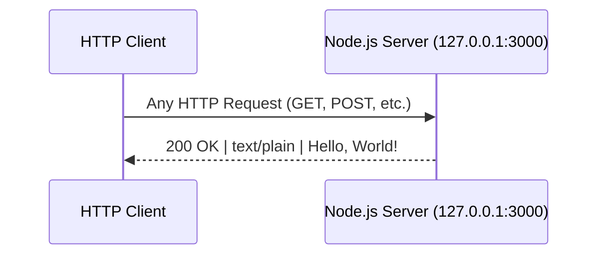
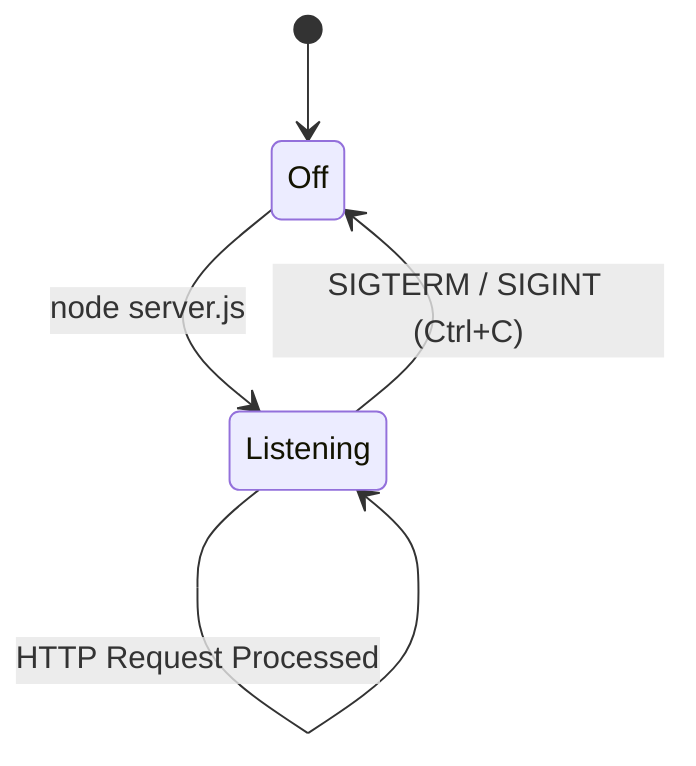

# hao-backprop-test

A minimal Node.js HTTP server that responds with "Hello, World!" to every incoming request. This is a test project for Backprop integration.

> **Package description** (from `package.json`): *"Hello world in Node.js"*


### Package Metadata

| Field | Value |
|-------|-------|
| **npm Package Name** | `hello_world` |
| **Version** | `1.0.0` |
| **Author** | `hxu` |
| **License** | MIT |

> *Source: `package.json`*

---

## Table of Contents

- [Prerequisites](#prerequisites)
- [Installation & Setup](#installation--setup)
- [Usage](#usage)
- [API Documentation](#api-documentation)
- [Deployment Guide](#deployment-guide)
- [Project Structure](#project-structure)
- [Configuration](#configuration)
- [Known Limitations](#known-limitations)
- [License](#license)

---

## Prerequisites

- **Node.js** version 18 or higher is recommended. You can verify your installed version with:

  ```bash
  node --version
  ```

- **No npm packages to install.** This project has zero external dependencies — it uses only the Node.js built-in `http` module. This is confirmed by `package.json` (no `dependencies` or `devDependencies` fields) and `package-lock.json` (lockfileVersion 3 with an empty packages set).

---

## Installation & Setup

1. **Clone the repository:**

   ```bash
   git clone <repository-url>
   ```

2. **Navigate to the project directory:**

   ```bash
   cd hao-backprop-test
   ```

3. **No `npm install` is needed** — the project uses only Node.js built-in modules. There are no external packages to download.

4. **Start the server:**

   ```bash
   node server.js
   ```

---

## Usage

Run the server with the following command:

```bash
node server.js
```

Once started, you will see the following console output:

```text
Server running at http://127.0.0.1:3000/
```

The server is now listening for HTTP requests on `http://127.0.0.1:3000/`.

> **Note:** The server binds to `127.0.0.1` (localhost only), so it is **not** accessible from other machines on the network. See the [Deployment Guide](#deployment-guide) for instructions on enabling external access.

---

## API Documentation

### Endpoint Overview

| Method | URL | Description |
|--------|-----|-------------|
| ANY | `http://127.0.0.1:3000/` | Returns a plain text greeting |

### Request/Response Details

The server responds **identically** to all HTTP methods (`GET`, `POST`, `PUT`, `DELETE`, etc.) and all URL paths.

| Property | Value |
|----------|-------|
| **Status Code** | `200 OK` |
| **Response Header** | `Content-Type: text/plain` |
| **Response Body** | `Hello, World!\n` |

*Source: `server.js` lines 37–44 — the request handler callback.*

### Example Usage

Send a request using `curl`:

```bash
curl http://127.0.0.1:3000/
```

Expected output:

```text
Hello, World!
```

You can also verify the response headers:

```bash
curl -i http://127.0.0.1:3000/
```

Expected output:

```text
HTTP/1.1 200 OK
Content-Type: text/plain
...

Hello, World!
```

### Request Flow Diagram



---

## Deployment Guide

### Local Development

- Run the server directly with:

  ```bash
  node server.js
  ```

- The server runs in the **foreground**. Press `Ctrl+C` to stop it.

### Production Considerations

- **Process Manager:** Use a process manager like [PM2](https://pm2.keymetrics.io/) for automatic restarts and process monitoring:

  ```bash
  pm2 start server.js
  ```

  Alternatively, configure a `systemd` service for Linux-based production environments.

- **External Access:** To allow connections from other machines on the network, change the `hostname` constant in `server.js` from `'127.0.0.1'` to `'0.0.0.0'`:

  ```javascript
  const hostname = '0.0.0.0';
  ```

- **Environment Variables:** Consider using environment variables for `hostname` and `port` in production environments instead of hardcoded constants, for example:

  ```javascript
  const hostname = process.env.HOST || '127.0.0.1';
  const port = process.env.PORT || 3000;
  ```

### Common Issues & Troubleshooting

| Error | Cause | Solution |
|-------|-------|----------|
| `EADDRINUSE` | Port 3000 is already in use by another process. | Stop the other process using port 3000, or change the `port` constant in `server.js` to an available port. |
| `EACCES` | Permission denied when binding to a port. Ports below 1024 require elevated privileges. | Port 3000 should not normally trigger this error. If using a low port, run with `sudo` or use a port above 1024. |
| Server not accessible from other machines | The server binds to `127.0.0.1` (localhost only) by default. | Change `hostname` in `server.js` from `'127.0.0.1'` to `'0.0.0.0'` to accept connections on all network interfaces. |

### Server Lifecycle



---

## Project Structure

This repository has a flat structure with all files at the root level:

| File | Description |
|------|-------------|
| `server.js` | Main HTTP server — entry point for the application |
| `server - Copy.js` | Duplicate copy of `server.js` |
| `package.json` | Node.js package manifest (project metadata) |
| `package-lock.json` | npm lockfile (confirms zero external dependencies) |
| `README.md` | Project documentation (this file) |
| `LoginTest.java` | Java login test stub (incomplete) |
| `LoginTest - Copy.java` | Duplicate copy of `LoginTest.java` |
| `industry.csv` | CSV file with industry category data |
| `industry - Copy.csv` | Duplicate copy of `industry.csv` |
| `100Pages.pdf` | PDF document (100-page sample file) |
| `100Pages - Copy.pdf` | Duplicate copy of `100Pages.pdf` |
| `demo.jpg` | JPEG image file (demo image) |
| `demo - Copy.jpg` | Duplicate copy of `demo.jpg` |
| `sample.doc` | Word document (sample file) |
| `sample - Copy.doc` | Duplicate copy of `sample.doc` |
| `.blitzyignore.txt` | Blitzy ignore patterns (empty) |
| `test.blitzyignore.txt` | Test Blitzy ignore file (empty) |
| `test1.blitzyignore.txt` | Test Blitzy ignore file (empty) |
| `test.py.txt` | Placeholder text file (empty) |
| `test.py - Copy.txt` | Duplicate placeholder text file (empty) |

---

## Configuration

The server configuration is defined via constants in `server.js`:

| Constant | Value | Description |
|----------|-------|-------------|
| `hostname` | `'127.0.0.1'` | Server bind address (localhost only) |
| `port` | `3000` | Server listen port |

> **Note:** These values are hardcoded. To change them, edit `server.js` directly. See [Production Considerations](#production-considerations) for guidance on using environment variables.

*Source: `server.js` lines 21 and 28.*

---

## Known Limitations

- **Localhost only:** The server binds to `127.0.0.1` — it is not accessible from external machines by default.
- **No request routing:** All paths and HTTP methods return the same response.
- **No middleware or logging:** There is no middleware, request logging, or error handling beyond Node.js defaults.
- **Entry point mismatch:** `package.json` declares `"main": "index.js"` but no `index.js` file exists in the repository. The actual entry point is `server.js`. Use `node server.js` to start the server.
- **No test suite:** The `npm test` script is a non-functional placeholder that outputs `"Error: no test specified"` and exits with code 1.

---

## License

This project is licensed under the **MIT License**.

As declared in `package.json`:

```json
"license": "MIT"
```
