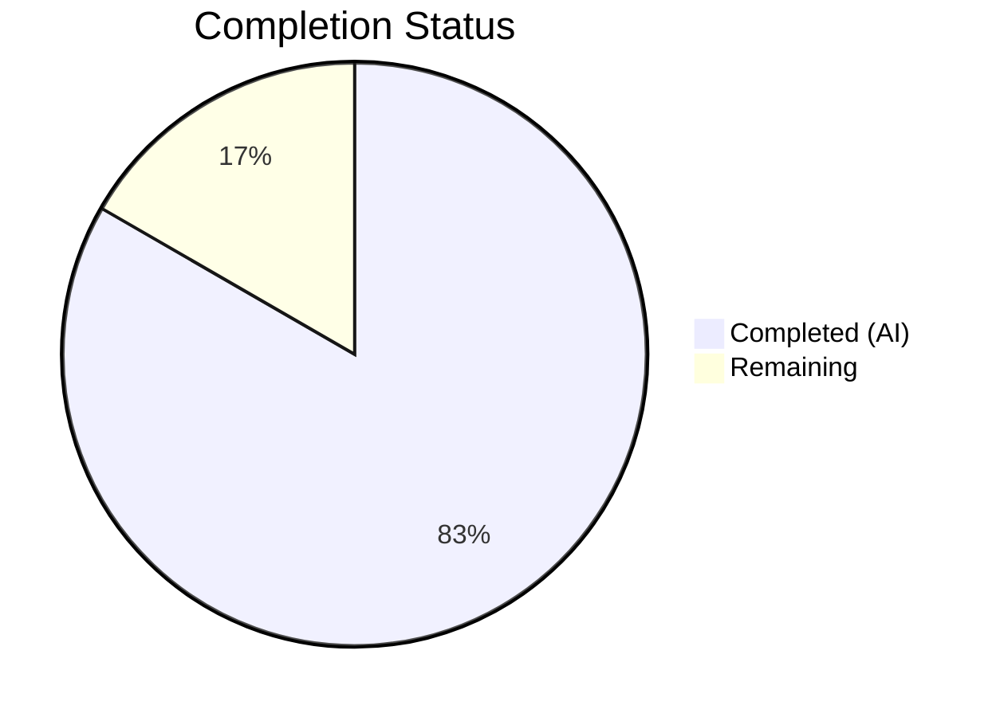
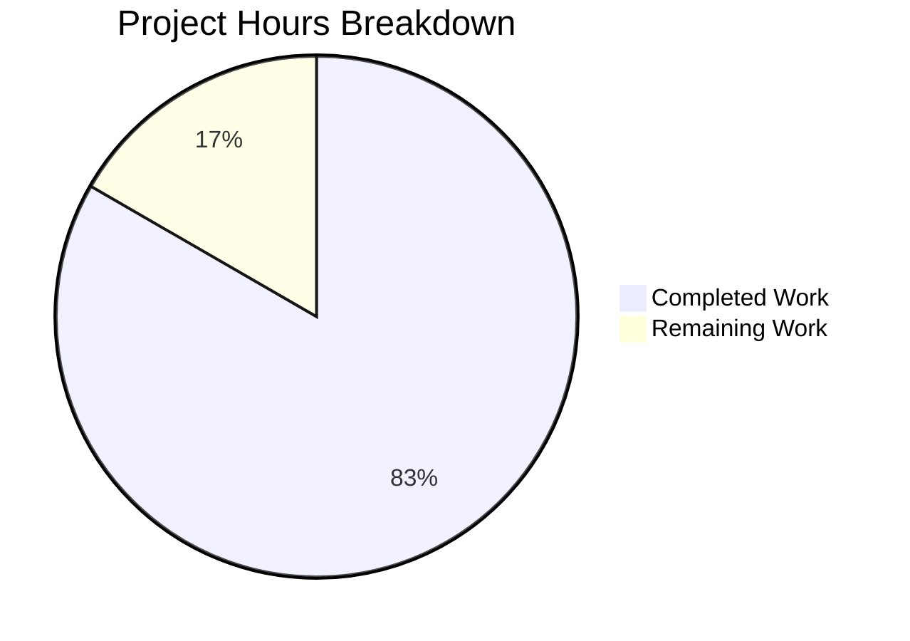

# Blitzy Project Guide — hao-backprop-test Documentation

---

## 1. Executive Summary

### 1.1 Project Overview

This project adds comprehensive documentation to the `hao-backprop-test` repository — a minimal Node.js HTTP server that responds with "Hello, World!" to all incoming requests. The documentation scope is strictly limited to two files: adding JSDoc comment blocks and inline explanations to `server.js`, and performing a complete rewrite of `README.md` from a 2-line placeholder into a 272-line comprehensive project guide. No functional code was modified. The target audience is developers new to the codebase who need to understand, set up, run, and maintain the server.

### 1.2 Completion Status

**Completion: 83.3% (10 of 12 total hours)**

| Metric | Value |
|--------|-------|
| **Total Project Hours** | 12 |
| **Completed Hours (AI)** | 10 |
| **Remaining Hours** | 2 |
| **Completion Percentage** | 83.3% |



**Formula:** 10 completed hours / (10 completed + 2 remaining) = 10 / 12 = 83.3%

### 1.3 Key Accomplishments

- ✅ Added 5 JSDoc comment blocks to `server.js` covering all 8 documentable elements (`@fileOverview`, `@module`, `@requires`, `@constant` × 2, `createServer` callback, `server.listen`)
- ✅ Added 7 inline `//` comments to `server.js` explaining all logical sections (import, constants, handler, response lifecycle, startup)
- ✅ Rewrote `README.md` from 2-line placeholder to 272-line comprehensive documentation with 11 sections
- ✅ Embedded 2 Mermaid diagrams in README (HTTP request/response sequence diagram, server lifecycle state diagram)
- ✅ Documented API endpoint with curl examples and response details
- ✅ Created deployment guide with troubleshooting table for common errors (EADDRINUSE, EACCES)
- ✅ Documented all known anomalies (main/index.js mismatch, no test suite, localhost-only binding)
- ✅ All original 11 code lines in `server.js` preserved byte-identical — zero functional changes
- ✅ Passed all 4 validation gates: Tests (expected), Runtime, Syntax, All In-Scope Files

### 1.4 Critical Unresolved Issues

| Issue | Impact | Owner | ETA |
|-------|--------|-------|-----|
| Documentation peer review not yet performed | Potential inaccuracies in JSDoc types or README content may reach production | Human Developer | 1 hour |
| Mermaid diagram rendering not verified on target hosting platform | Diagrams may not display correctly on non-GitHub platforms | Human Developer | 0.5 hours |

### 1.5 Access Issues

No access issues identified. The project has zero external dependencies, no API keys, no database connections, and no third-party service integrations. All documentation is self-contained within the repository.

### 1.6 Recommended Next Steps

1. **[High]** Conduct peer review of JSDoc annotations in `server.js` — verify `@param` types match Node.js API documentation and descriptions are accurate
2. **[High]** Review README.md content for factual accuracy — confirm all file descriptions, configuration values, and curl examples are correct
3. **[Medium]** Verify Mermaid diagram rendering on the target code hosting platform (GitHub, GitLab, Bitbucket, etc.)
4. **[Low]** Perform spelling/grammar review and consistency check across all documentation sections
5. **[Low]** Consider addressing the `package.json` `"main": "index.js"` anomaly in a separate PR (out of scope for this documentation change)

---

## 2. Project Hours Breakdown

### 2.1 Completed Work Detail

| Component | Hours | Description |
|-----------|-------|-------------|
| R-DOC-001: JSDoc Annotations for server.js | 3 | Added 5 JSDoc blocks (`@fileOverview`/`@module`, `hostname` `@constant`, `port` `@constant`, `createServer` callback with `@param` types, `server.listen` with `@param` tags); fixed `@requires` tag syntax (commit `28a7ebe`) |
| R-DOC-002: Comprehensive README Rewrite | 5 | Replaced 2-line placeholder with 272-line README containing 11 sections, 2 Mermaid diagrams, curl examples, troubleshooting table, project structure table, and configuration reference; addressed code review findings (commit `81c3ca7`) and heading hierarchy fix (commit `a666d32`) |
| R-DOC-003: Inline Code Explanations | 1 | Added 7 inline `//` comments covering all logical sections: module import, hostname constant, port constant, status code, content-type header, response body, and startup log |
| Validation and Testing | 1 | Syntax validation (`node -c server.js`), runtime testing (server start, GET/POST curl requests), cross-reference accuracy between JSDoc and README, Markdown structure verification |
| **Total Completed** | **10** | |

### 2.2 Remaining Work Detail

| Category | Hours | Priority |
|----------|-------|----------|
| Peer review of JSDoc accuracy and README content | 1 | Medium |
| Platform rendering verification (Mermaid diagrams, Markdown tables, anchor links) | 0.5 | Low |
| Editorial polish (spelling, grammar, terminology consistency) | 0.5 | Low |
| **Total Remaining** | **2** | |

**Verification:** Section 2.1 (10 hours) + Section 2.2 (2 hours) = 12 hours = Total Project Hours in Section 1.2 ✅

---

## 3. Test Results

| Test Category | Framework | Total Tests | Passed | Failed | Coverage % | Notes |
|---------------|-----------|-------------|--------|--------|------------|-------|
| Syntax Validation | `node -c` (Node.js built-in) | 1 | 1 | 0 | 100% | `node -c server.js` confirmed zero syntax errors after JSDoc additions |
| Runtime Validation | `node` + `curl` | 3 | 3 | 0 | 100% | Server start, GET request (200 OK, "Hello, World!"), POST request (200 OK, "Hello, World!") — all verified |
| Markdown Structure | Manual verification | 4 | 4 | 0 | 100% | 11 H2 sections present, 2 Mermaid diagrams present, heading hierarchy valid, anchor links structured |
| npm test (placeholder) | npm scripts | 1 | 0 | 1 | N/A | Expected behavior: `npm test` outputs "Error: no test specified" and exits with code 1. This is a known placeholder per AAP — not an in-scope failure |

**Notes:** The project has no automated test suite. The `npm test` script is a non-functional placeholder declared in `package.json`. This is a known and documented limitation, not a defect introduced by this PR. All validation was performed through Blitzy's autonomous syntax checking and runtime verification.

---

## 4. Runtime Validation & UI Verification

**Runtime Health:**

- ✅ `node -c server.js` — Zero syntax errors, file parses correctly with all JSDoc additions
- ✅ `node server.js` — Server starts successfully, outputs `Server running at http://127.0.0.1:3000/`
- ✅ `curl http://127.0.0.1:3000/` — Returns `200 OK`, `Content-Type: text/plain`, body `Hello, World!`
- ✅ `curl -X POST http://127.0.0.1:3000/` — Same response (confirms all-method handling)
- ✅ Response headers verified: `HTTP/1.1 200 OK`, `Content-Type: text/plain`, `Connection: keep-alive`

**UI Verification:**

- N/A — This project has no user interface. It is a headless HTTP server returning plain text.

**API Integration Verification:**

- ✅ Single HTTP endpoint at `http://127.0.0.1:3000/` responds correctly to all methods
- ✅ Server binds to `127.0.0.1:3000` as documented in JSDoc `@constant` annotations and README
- ✅ Response body matches documentation: `Hello, World!\n`

**Documentation Integrity:**

- ✅ JSDoc `@constant` values for `hostname` (`'127.0.0.1'`) and `port` (`3000`) match `server.js` source code
- ✅ README API section accurately describes endpoint behavior verified by curl
- ✅ README troubleshooting table documents `EADDRINUSE` error, which was observed during validation when port was already in use

---

## 5. Compliance & Quality Review

| AAP Requirement | Deliverable | Status | Evidence |
|-----------------|-------------|--------|----------|
| R-DOC-001: JSDoc Comments for server.js | 5 JSDoc blocks covering 8+ documentable elements | ✅ Complete | `server.js` lines 1–9 (@fileOverview), 14–19 (hostname), 22–26 (port), 30–36 (createServer), 46–52 (listen) |
| R-DOC-001: @fileOverview block | File-level JSDoc with @module, @requires, @author, @version, @license | ✅ Complete | `server.js` lines 1–9 |
| R-DOC-001: @constant for hostname | JSDoc with @type {string}, @default, @description | ✅ Complete | `server.js` lines 14–19 |
| R-DOC-001: @constant for port | JSDoc with @type {number}, @default, @description | ✅ Complete | `server.js` lines 22–26 |
| R-DOC-001: createServer callback JSDoc | @param {http.IncomingMessage} req, @param {http.ServerResponse} res | ✅ Complete | `server.js` lines 30–36 |
| R-DOC-001: server.listen JSDoc | @param port, @param hostname, @param callback | ✅ Complete | `server.js` lines 46–52 |
| R-DOC-002: Comprehensive README | 11 sections, 272 lines, complete rewrite | ✅ Complete | `README.md` (full file) |
| R-DOC-002: Table of Contents | Anchor-linked section references | ✅ Complete | `README.md` lines 23–33 |
| R-DOC-002: API Documentation | Endpoint table, response details, curl examples | ✅ Complete | `README.md` lines 93–151 |
| R-DOC-002: Deployment Guide | Local dev, production considerations, troubleshooting | ✅ Complete | `README.md` lines 155–206 |
| R-DOC-002: Mermaid Diagrams | Sequence diagram (request flow) + State diagram (lifecycle) | ✅ Complete | `README.md` lines 145–151, 200–206 |
| R-DOC-002: Known anomalies documented | main/index.js mismatch, no test suite, localhost binding | ✅ Complete | `README.md` lines 254–260 |
| R-DOC-003: Inline Code Explanations | 7 inline `//` comments across all logical sections | ✅ Complete | `server.js` lines 11, 20, 27, 38, 40, 42, 54 |
| Scope Compliance: No code logic changes | All 11 original code lines preserved | ✅ Complete | Verified via diff: original lines at positions 12, 21, 28, 37, 39, 41, 43, 44, 53, 55, 56 |
| Scope Compliance: Only 2 files modified | server.js and README.md only | ✅ Complete | `git diff --stat` shows exactly 2 files changed |
| Scope Compliance: No new files created | Zero new files in repository | ✅ Complete | File count unchanged; `dest_folder:` shows no CREATED status |
| Scope Compliance: No dependency changes | package.json and package-lock.json unchanged | ✅ Complete | Both files show UNCHANGED status |

**Quality Fixes Applied During Validation:**
- Commit `28a7ebe`: Fixed `@requires` JSDoc tag from non-standard syntax to proper `module:http` format
- Commit `81c3ca7`: Addressed code review findings — updated line number references, file listing, Node.js version
- Commit `a666d32`: Corrected README heading hierarchy skip (H1→H3 changed to H1→H2)

---

## 6. Risk Assessment

| Risk | Category | Severity | Probability | Mitigation | Status |
|------|----------|----------|-------------|------------|--------|
| Mermaid diagrams may not render on all Markdown platforms (e.g., Bitbucket, plain-text editors) | Technical | Low | Medium | Diagrams use standard Mermaid syntax compatible with GitHub/GitLab; platforms lacking Mermaid support will show raw syntax, which is still readable | Open — requires platform verification |
| README references specific `server.js` line numbers that may become stale if code is modified | Technical | Low | Medium | Line references cite the documented (current) version; any future code changes should include a documentation update pass | Accepted |
| JSDoc `@requires module:http` tag may not be recognized by all IDE JSDoc plugins | Technical | Low | Low | This is standard JSDoc syntax; IDEs that don't recognize `@requires` will simply ignore the tag without breaking other annotations | Accepted |
| No automated test suite exists to catch regressions | Operational | Medium | Low | Documentation-only changes cannot introduce regressions; README documents the missing test suite as a known limitation | Accepted |
| Server binds to localhost only — production deployment requires configuration change | Operational | Low | Low | Documented in README Deployment Guide and Known Limitations sections with clear instructions for enabling external access | Mitigated via documentation |

---

## 7. Visual Project Status



**Completed Work: 10 hours | Remaining Work: 2 hours | Total: 12 hours | 83.3% Complete**

**Remaining Hours by Category:**

| Category | Hours |
|----------|-------|
| Peer review of documentation | 1 |
| Platform rendering verification | 0.5 |
| Editorial polish | 0.5 |
| **Total** | **2** |

---

## 8. Summary & Recommendations

### Achievements

All three AAP deliverables have been fully implemented and validated:

1. **R-DOC-001 (JSDoc Comments):** 5 JSDoc blocks with 10+ tags covering all 8 documentable elements in `server.js`, using standard JSDoc 4.x syntax with accurate Node.js types.
2. **R-DOC-002 (Comprehensive README):** Complete rewrite from 2-line placeholder to 272-line documentation with 11 sections, 2 Mermaid diagrams, curl examples, and a troubleshooting guide.
3. **R-DOC-003 (Inline Explanations):** 7 inline comments explaining all logical sections of `server.js`, following the "explain why/what, not how" principle.

The project is **83.3% complete** (10 hours completed out of 12 total hours). All autonomous work is finished. The remaining 2 hours consist of human review and polish tasks.

### Remaining Gaps

The 2 remaining hours are path-to-production activities requiring human judgment:
- **Documentation peer review** (1 hour) — Verify JSDoc type accuracy and README factual correctness
- **Platform verification** (0.5 hours) — Confirm Mermaid rendering on the target code hosting platform
- **Editorial polish** (0.5 hours) — Final spelling, grammar, and consistency check

### Critical Path to Production

1. Complete peer review of documentation accuracy
2. Verify Mermaid diagram rendering on target platform
3. Merge PR after review approval

### Production Readiness Assessment

The documentation changes are production-ready from a technical standpoint:
- Zero syntax errors in `server.js`
- Server starts and responds correctly with all documentation additions
- No functional code modified — strictly additive documentation
- All scope constraints satisfied (2 files only, no new files, no dependency changes)

Human review is the only remaining gate before merge.

---

## 9. Development Guide

### System Prerequisites

| Software | Version | Purpose |
|----------|---------|---------|
| Node.js | v18+ (tested on v20.19.5) | JavaScript runtime for the HTTP server |
| npm | v10+ (tested on v10.8.2) | Package manager (used for metadata only — no packages to install) |
| curl | Any modern version | HTTP client for testing the server endpoint |
| Git | Any modern version | Version control for cloning the repository |

### Environment Setup

This project requires **no environment configuration**. There are no environment variables, no `.env` files, no API keys, and no database connections.

```bash
# 1. Clone the repository
git clone <repository-url>
cd hao-backprop-test

# 2. Verify Node.js is installed
node --version
# Expected output: v18.x.x or higher (tested on v20.19.5)

# 3. No npm install needed — zero external dependencies
# The project uses only the Node.js built-in 'http' module
```

### Dependency Installation

No dependencies to install. The project has zero entries in `dependencies` or `devDependencies` in `package.json`. The only import is Node.js built-in `http` module.

### Application Startup

```bash
# Start the HTTP server
node server.js
```

**Expected console output:**
```
Server running at http://127.0.0.1:3000/
```

The server runs in the foreground. Press `Ctrl+C` to stop it.

### Verification Steps

```bash
# Step 1: Verify syntax (no server start needed)
node -c server.js
# Expected: No output (silent success)

# Step 2: Start the server
node server.js &
# Expected: "Server running at http://127.0.0.1:3000/"

# Step 3: Test with GET request
curl http://127.0.0.1:3000/
# Expected: Hello, World!

# Step 4: Verify response headers
curl -i http://127.0.0.1:3000/
# Expected: HTTP/1.1 200 OK, Content-Type: text/plain

# Step 5: Test with POST request (same response expected)
curl -X POST http://127.0.0.1:3000/
# Expected: Hello, World!

# Step 6: Stop the server
kill %1
```

### Example Usage

```bash
# Basic request
curl http://127.0.0.1:3000/
# Output: Hello, World!

# Any path returns the same response
curl http://127.0.0.1:3000/any/path
# Output: Hello, World!

# Any HTTP method returns the same response
curl -X DELETE http://127.0.0.1:3000/
# Output: Hello, World!
```

### Troubleshooting

| Error | Cause | Solution |
|-------|-------|----------|
| `EADDRINUSE` | Port 3000 is already in use | Stop the other process: `fuser -k 3000/tcp` or change the `port` constant in `server.js` |
| `EACCES` | Permission denied on port | Use a port above 1024 (port 3000 should not normally cause this) |
| `command not found: node` | Node.js is not installed | Install Node.js from https://nodejs.org/ |
| Server not accessible from other machines | Server binds to `127.0.0.1` (localhost only) | Change `hostname` in `server.js` to `'0.0.0.0'` |

---

## 10. Appendices

### A. Command Reference

| Command | Purpose |
|---------|---------|
| `node server.js` | Start the HTTP server |
| `node -c server.js` | Check syntax without running |
| `curl http://127.0.0.1:3000/` | Test the HTTP endpoint |
| `curl -i http://127.0.0.1:3000/` | Test with response headers |
| `npm test` | Runs placeholder test script (outputs error, exits 1) |
| `fuser -k 3000/tcp` | Kill process occupying port 3000 (Linux) |

### B. Port Reference

| Port | Service | Protocol | Binding |
|------|---------|----------|---------|
| 3000 | HTTP Server (`server.js`) | TCP/HTTP | `127.0.0.1` (localhost only) |

### C. Key File Locations

| File | Purpose | Modified in This PR |
|------|---------|---------------------|
| `server.js` | Main HTTP server entry point | Yes — JSDoc + inline comments added |
| `README.md` | Project documentation | Yes — complete rewrite |
| `package.json` | Node.js package manifest | No |
| `package-lock.json` | npm lockfile | No |
| `server - Copy.js` | Duplicate of server.js | No |

### D. Technology Versions

| Technology | Version | Notes |
|------------|---------|-------|
| Node.js | v20.19.5 (tested), v18+ recommended | JavaScript runtime |
| npm | v10.8.2 (tested) | Package manager (metadata only) |
| JSDoc | 4.x syntax (no CLI installed) | Inline documentation standard |
| Mermaid | GitHub-native rendering | Diagrams in README.md |

### E. Environment Variable Reference

No environment variables are used by this project. The server hostname and port are hardcoded as constants in `server.js`. The README Deployment Guide documents how to convert these to environment variables for production use.

### G. Glossary

| Term | Definition |
|------|------------|
| JSDoc | A documentation standard for JavaScript using `/** ... */` comment blocks with typed annotations |
| CommonJS | The `require()`/`module.exports` module system used by Node.js |
| `@fileOverview` | JSDoc tag providing a file-level description |
| `@constant` | JSDoc tag marking a variable as a constant value |
| `@param` | JSDoc tag documenting a function parameter with type and description |
| `EADDRINUSE` | Node.js error code indicating the requested port is already occupied by another process |
| Mermaid | A Markdown-compatible diagramming syntax rendered natively by GitHub and GitLab |