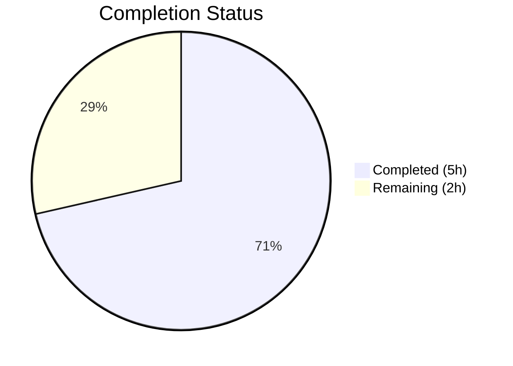
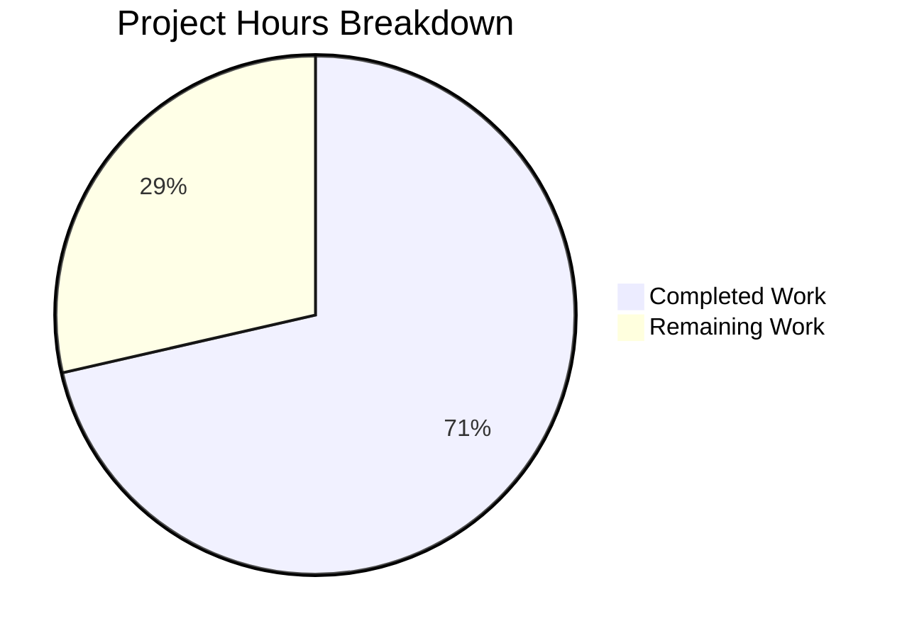

# Blitzy Project Guide

---

## 1. Executive Summary

### 1.1 Project Overview

This project integrates the Express.js framework (v5.2.1) into an existing minimal Node.js "Hello World" HTTP server. The migration replaces the built-in `http.createServer()` pattern with Express's structured routing and middleware architecture, preserves the original `GET /` endpoint returning `"Hello, World!\n"`, and adds a new `GET /evening` endpoint returning `"Good evening"`. The scope is confined to three files (`server.js`, `package.json`, `package-lock.json`) in a flat, single-directory repository, adhering strictly to the minimal changes rule.

### 1.2 Completion Status



| Metric | Value |
|--------|-------|
| **Total Project Hours** | **7** |
| Completed Hours (AI) | 5 |
| Remaining Hours (Human) | 2 |
| **Completion Percentage** | **71.4%** |

**Calculation:** 5 completed hours / (5 completed + 2 remaining) = 5 / 7 = **71.4% complete**

### 1.3 Key Accomplishments

- [x] Migrated `server.js` from `http.createServer()` to Express.js application pattern
- [x] Preserved `GET /` route returning exact `"Hello, World!\n"` response (backward compatible)
- [x] Added new `GET /evening` route returning `"Good evening"`
- [x] Registered `express@^5.2.1` as dependency in `package.json`
- [x] Regenerated `package-lock.json` with full Express 5.2.1 transitive dependency tree (65 packages)
- [x] Validated syntax with `node -c server.js` — zero errors
- [x] Validated runtime — both endpoints return correct responses at `127.0.0.1:3000`
- [x] Dependency audit — zero vulnerabilities detected
- [x] Maintained CommonJS `require()` module convention throughout
- [x] Zero modifications to any out-of-scope files

### 1.4 Critical Unresolved Issues

| Issue | Impact | Owner | ETA |
|-------|--------|-------|-----|
| No environment variable support for PORT/HOST | Server hardcodes `127.0.0.1:3000`, preventing flexible deployment | Human Developer | 1 hour |
| No production process manager configured | Server runs as bare `node` process with no restart/monitoring | Human Developer | 1 hour |

### 1.5 Access Issues

No access issues identified. All dependencies were installed from the public npm registry without authentication. The repository is fully accessible on the current branch.

### 1.6 Recommended Next Steps

1. **[High]** Configure environment variables for `PORT` and `HOST` to enable flexible deployment across environments
2. **[High]** Set up a production process manager (PM2, Docker, or cloud platform) for reliable server operation
3. **[Medium]** Add basic smoke tests for both endpoints to prevent regressions
4. **[Low]** Update `README.md` to document the new `/evening` endpoint and Express.js dependency
5. **[Low]** Correct the `"main": "index.js"` field in `package.json` to `"main": "server.js"`

---

## 2. Project Hours Breakdown

### 2.1 Completed Work Detail

| Component | Hours | Description |
|-----------|-------|-------------|
| Express.js Server Migration | 2 | Replaced `http.createServer()` with `const app = express()` in `server.js`; wired `app.listen()` preserving hostname, port, and startup log callback |
| Route Handler Implementation | 1 | Defined `GET /` route preserving `"Hello, World!\n"` response; added new `GET /evening` route returning `"Good evening"` |
| Dependency Management | 1 | Added `express@^5.2.1` to `package.json` dependencies; regenerated `package-lock.json` with 65 transitive packages; verified with `npm ls` |
| Validation & Runtime Testing | 1 | Syntax validation (`node -c`), dependency audit (`npm audit` — 0 vulnerabilities), runtime endpoint testing (`curl` for both routes + 404 behavior) |
| **Total Completed** | **5** | |

### 2.2 Remaining Work Detail

| Category | Hours | Priority |
|----------|-------|----------|
| Environment Variable Configuration | 1 | High |
| Production Deployment Setup | 1 | High |
| **Total Remaining** | **2** | |

**Verification:** 5 (completed) + 2 (remaining) = 7 (total project hours) ✓

---

## 3. Test Results

| Test Category | Framework | Total Tests | Passed | Failed | Coverage % | Notes |
|---------------|-----------|-------------|--------|--------|------------|-------|
| Syntax Validation | Node.js (`node -c`) | 1 | 1 | 0 | N/A | `node -c server.js` — zero syntax errors |
| Dependency Audit | npm (`npm audit`) | 1 | 1 | 0 | N/A | 0 vulnerabilities across 65 packages |
| Runtime — GET / | curl (manual) | 1 | 1 | 0 | N/A | Returns `"Hello, World!\n"` with HTTP 200 |
| Runtime — GET /evening | curl (manual) | 1 | 1 | 0 | N/A | Returns `"Good evening"` with HTTP 200 |
| Runtime — 404 handling | curl (manual) | 1 | 1 | 0 | N/A | Unknown routes return HTTP 404 (Express default) |
| JSON Validation | Node.js (`JSON.parse`) | 1 | 1 | 0 | N/A | `package.json` valid JSON confirmed |
| **Totals** | | **6** | **6** | **0** | | **100% pass rate** |

> **Note:** No automated test suite exists in this project. The `npm test` script is a pre-existing placeholder (`echo "Error: no test specified" && exit 1`). Adding a test framework was explicitly documented as out-of-scope in the AAP. All tests above were executed by Blitzy's autonomous validation pipeline.

---

## 4. Runtime Validation & UI Verification

### Runtime Health

- ✅ **Server startup**: `node server.js` starts successfully, logs `Server running at http://127.0.0.1:3000/`
- ✅ **GET /** → `"Hello, World!\n"` (HTTP 200, Content-Type: text/html; charset=utf-8)
- ✅ **GET /evening** → `"Good evening"` (HTTP 200, Content-Type: text/html; charset=utf-8)
- ✅ **404 handling** → Unknown routes return HTTP 404 (Express default behavior)
- ✅ **Express headers** → `X-Powered-By: Express` header present, ETag enabled
- ✅ **Process cleanup** → Server shuts down cleanly on SIGTERM

### Dependency Health

- ✅ **npm ls** → Clean dependency tree, `express@5.2.1` resolved correctly
- ✅ **npm audit** → 0 vulnerabilities found
- ✅ **Git status** → Clean working tree (only `node_modules/` untracked, correctly excluded)

### UI Verification

- N/A — This is a backend-only HTTP server with no frontend or UI components.

---

## 5. Compliance & Quality Review

| AAP Requirement | Status | Evidence |
|----------------|--------|----------|
| Replace `http.createServer()` with Express.js | ✅ Pass | `server.js` line 1: `const express = require('express')` |
| Preserve `GET /` returning `"Hello, World!\n"` | ✅ Pass | `server.js` lines 7–9; verified via `curl` |
| Add `GET /evening` returning `"Good evening"` | ✅ Pass | `server.js` lines 11–13; verified via `curl` |
| Add `express@^5.2.1` to `package.json` dependencies | ✅ Pass | `package.json` lines 11–13 |
| Regenerate `package-lock.json` | ✅ Pass | 814 lines added; `npm ls` confirms full tree |
| Use CommonJS `require()` syntax | ✅ Pass | `const express = require('express')` — no ES module imports |
| Retain `127.0.0.1:3000` binding | ✅ Pass | `const hostname = '127.0.0.1'; const port = 3000;` unchanged |
| Preserve startup console.log message | ✅ Pass | Template literal in `app.listen()` callback matches original |
| No changes to out-of-scope files | ✅ Pass | `git diff --name-status` shows only 3 target files modified |
| `server - Copy.js` untouched | ✅ Pass | File status: UNCHANGED |
| No middleware added | ✅ Pass | No `app.use()` calls in `server.js` |
| No new files created | ✅ Pass | File inventory unchanged; only modifications to existing files |
| Minimal changes rule | ✅ Pass | 3 files modified, 9 lines added / 6 removed in `server.js` |

### Autonomous Fixes Applied

No fixes were required during validation. All implementations passed on first validation cycle.

---

## 6. Risk Assessment

| Risk | Category | Severity | Probability | Mitigation | Status |
|------|----------|----------|-------------|------------|--------|
| Hardcoded port/hostname blocks deployment flexibility | Operational | Medium | High | Introduce `process.env.PORT` and `process.env.HOST` fallbacks | Open |
| No process manager for crash recovery | Operational | Medium | Medium | Configure PM2, systemd, or container orchestration | Open |
| No automated test suite for regression detection | Technical | Low | Medium | Add minimal smoke tests using a lightweight test runner | Open |
| `X-Powered-By: Express` header exposes framework version | Security | Low | Low | Add `app.disable('x-powered-by')` or use `helmet` middleware | Open |
| `"main": "index.js"` points to non-existent file | Technical | Low | Low | Correct to `"server.js"` (out of AAP scope but noted) | Deferred |
| Express 5.x is relatively new (GA since late 2024) | Technical | Low | Low | Monitor for breaking changes; pin version in `package-lock.json` | Mitigated |

---

## 7. Visual Project Status



**Completed: 5 hours (71.4%) | Remaining: 2 hours (28.6%)**

### Remaining Work by Priority

| Priority | Category | Hours |
|----------|----------|-------|
| 🔴 High | Environment Variable Configuration | 1 |
| 🔴 High | Production Deployment Setup | 1 |
| **Total** | | **2** |

---

## 8. Summary & Recommendations

### Achievement Summary

The project successfully completed all Agent Action Plan requirements, achieving **71.4% overall completion** (5 of 7 total project hours). Every AAP-specified deliverable has been implemented, validated, and committed:

- The Express.js framework (v5.2.1) has been fully integrated, replacing the built-in `http` module
- Both route handlers (`GET /` and `GET /evening`) are operational and returning correct responses
- Dependency management is clean with zero vulnerabilities across 65 transitive packages
- The minimal changes rule was strictly followed — only 3 target files were modified with no out-of-scope changes

### Remaining Gaps

The outstanding 2 hours (28.6%) represent standard path-to-production activities that were not part of the AAP scope:

1. **Environment Variable Configuration (1h):** The server currently hardcodes `127.0.0.1:3000`. Production deployments require reading `PORT` and `HOST` from environment variables with sensible defaults.
2. **Production Deployment Setup (1h):** A production process manager (PM2, Docker container, or cloud platform service) is needed for crash recovery, logging, and monitoring.

### Production Readiness Assessment

| Gate | Status |
|------|--------|
| All AAP requirements met | ✅ |
| Code compiles / syntax valid | ✅ |
| Runtime endpoints operational | ✅ |
| Dependencies secure (0 vulns) | ✅ |
| Environment-agnostic configuration | ⚠️ Needs env vars |
| Production process management | ⚠️ Needs PM2/Docker |

**Recommendation:** The codebase is functionally complete for the specified requirements. A human developer should allocate approximately **2 hours** to configure environment variables and production deployment infrastructure before releasing to production.

---

## 9. Development Guide

### System Prerequisites

| Software | Required Version | Verification Command |
|----------|-----------------|---------------------|
| Node.js | >= 18.0.0 (tested with v20.19.5) | `node -v` |
| npm | >= 7.0.0 (tested with v10.8.2) | `npm -v` |

### Environment Setup

```bash
# Clone the repository and switch to the feature branch
git clone <repository-url>
cd <repository-root>
git checkout blitzy-7ac94128-dd7d-4e77-b1b0-de9591462f11
```

No environment variables are required for local development. The server defaults to `127.0.0.1:3000`.

### Dependency Installation

```bash
# Install all dependencies (Express.js 5.2.1 + transitive packages)
npm install
```

**Expected output:**
```
added 65 packages in <time>
```

**Verify installation:**
```bash
npm ls
```

**Expected output:**
```
hello_world@1.0.0
└── express@5.2.1
```

### Application Startup

```bash
# Start the server
node server.js
```

**Expected output:**
```
Server running at http://127.0.0.1:3000/
```

### Verification Steps

```bash
# Test the Hello World endpoint
curl http://127.0.0.1:3000/
# Expected: Hello, World!

# Test the Good Evening endpoint
curl http://127.0.0.1:3000/evening
# Expected: Good evening

# Verify 404 handling for unknown routes
curl -s -o /dev/null -w "%{http_code}" http://127.0.0.1:3000/nonexistent
# Expected: 404
```

### Example Usage

```bash
# Full startup and test sequence
npm install
node server.js &
sleep 1
curl http://127.0.0.1:3000/
curl http://127.0.0.1:3000/evening
kill %1
```

### Troubleshooting

| Issue | Cause | Resolution |
|-------|-------|------------|
| `Error: Cannot find module 'express'` | Dependencies not installed | Run `npm install` |
| `EADDRINUSE: address already in use :::3000` | Port 3000 occupied | Kill the existing process: `lsof -i :3000` then `kill <PID>` |
| `ERR_SOCKET_BAD_PORT` | Invalid port value | Ensure `const port = 3000` is a valid integer |

---

## 10. Appendices

### A. Command Reference

| Command | Purpose |
|---------|---------|
| `npm install` | Install all dependencies from `package.json` |
| `node server.js` | Start the Express.js server |
| `node -c server.js` | Validate JavaScript syntax without executing |
| `npm ls` | Display installed dependency tree |
| `npm audit` | Check dependencies for known vulnerabilities |
| `curl http://127.0.0.1:3000/` | Test the Hello World endpoint |
| `curl http://127.0.0.1:3000/evening` | Test the Good Evening endpoint |

### B. Port Reference

| Service | Port | Host | Protocol |
|---------|------|------|----------|
| Express.js HTTP Server | 3000 | 127.0.0.1 | HTTP |

### C. Key File Locations

| File | Purpose |
|------|---------|
| `server.js` | Express.js application entry point with route definitions |
| `package.json` | npm package manifest with Express dependency |
| `package-lock.json` | Locked dependency tree (65 transitive packages) |
| `server - Copy.js` | Original `http` module server backup (unchanged) |

### D. Technology Versions

| Technology | Version | Notes |
|------------|---------|-------|
| Node.js | v20.19.5 | Runtime environment |
| npm | v10.8.2 | Package manager |
| Express.js | 5.2.1 | Web framework (requires Node.js >= 18) |

### E. Environment Variable Reference

| Variable | Default | Description | Status |
|----------|---------|-------------|--------|
| PORT | 3000 (hardcoded) | Server listening port | Not yet configurable — requires human task |
| HOST | 127.0.0.1 (hardcoded) | Server bind address | Not yet configurable — requires human task |

### G. Glossary

| Term | Definition |
|------|------------|
| AAP | Agent Action Plan — the primary directive containing all project requirements |
| CommonJS | Node.js module system using `require()` and `module.exports` |
| Express.js | Minimal, flexible Node.js web application framework providing routing and middleware |
| Transitive dependency | A package required by a direct dependency (e.g., packages Express itself depends on) |
| Path-to-production | Standard activities required to deploy deliverables to a production environment |
