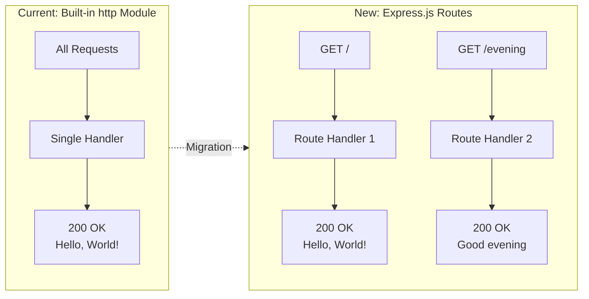

# Technical Specification

# 0. Agent Action Plan

## 0.1 Intent Clarification

### 0.1.1 Core Feature Objective

Based on the prompt, the Blitzy platform understands that the new feature requirement is to integrate the Express.js framework into an existing minimal Node.js HTTP server project and add a new HTTP endpoint. The current project is a tutorial-style "Hello World" server that uses only the Node.js built-in `http` module (in `server.js`) to serve a single static response of `"Hello, World!\n"` on all incoming requests at `127.0.0.1:3000`. The specific requirements are:

- **Integrate Express.js into the project**: Replace the raw `http.createServer()` approach in `server.js` with the Express.js framework, introducing proper routing, middleware capabilities, and a structured request-handling pattern.
- **Preserve the existing "Hello World" endpoint**: The current behavior of returning `"Hello, World!"` must remain accessible as a dedicated route endpoint rather than as a catch-all handler.
- **Add a new "Good evening" endpoint**: Create a new route that returns the response `"Good evening"` as plain text, accessible via a distinct URL path.

Implicit requirements detected:

- Express.js must be added as an npm dependency in `package.json` and installed via `npm install`.
- The `package-lock.json` must be regenerated to reflect the new Express dependency tree.
- The server startup mechanism (`server.listen()`) must be adapted to use Express's `app.listen()` pattern.
- The existing `server - Copy.js` (a byte-identical duplicate of `server.js`) is a static backup/test artifact and does not need to be modified.
- The `main` field in `package.json` currently points to a non-existent `index.js`; this may be corrected to `server.js` to align with the actual entry point.

### 0.1.2 Special Instructions and Constraints

- **Minimal changes rule**: The user has specified that all changes must be confined to the defined scope and nowhere else. Public interfaces, side effects, data flows, and dependencies must be maintained unless explicitly mandated. No opportunistic refactoring, cascading changes, or global updates are permitted. Changes must be minimal, isolated, and fully aligned with the scoped objective.
- **Maintain backward compatibility**: The existing "Hello World" response must remain available after migration to Express.js.
- **Follow repository conventions**: The project uses CommonJS (`require()`) module syntax; Express must be imported via `const express = require('express')` to maintain consistency.
- **No UI component**: This is a backend-only server — no design system, CSS, or frontend framework applies.

### 0.1.3 Technical Interpretation

These feature requirements translate to the following technical implementation strategy:

- To **integrate Express.js**, we will modify `server.js` to replace the `http.createServer()` pattern with an Express application instance using `const app = express()`, and replace `server.listen()` with `app.listen()`.
- To **preserve the "Hello World" response**, we will create a dedicated Express route handler (e.g., `app.get('/', ...)`) that responds with `"Hello, World!\n"` at the root path `/`, matching the current behavior.
- To **add the "Good evening" endpoint**, we will create a new Express route handler (e.g., `app.get('/evening', ...)`) that responds with `"Good evening"` at a distinct path.
- To **register Express as a dependency**, we will add `express` (version `5.2.1`, the current latest on npm) to the `dependencies` section of `package.json` and regenerate `package-lock.json`.

## 0.2 Repository Scope Discovery

### 0.2.1 Comprehensive File Analysis

The repository is a flat, single-directory project with 14 files and no subdirectories. A complete inventory of all files and their relevance to this feature addition follows:

| File | Type | Relevance | Action Required |
|------|------|-----------|-----------------|
| `server.js` | JavaScript (Node.js) | **Primary target** — sole functional server file; contains the `http.createServer()` implementation to be migrated to Express | MODIFY |
| `package.json` | npm manifest | **Primary target** — must add `express` as a dependency; optionally fix `main` field | MODIFY |
| `package-lock.json` | npm lockfile | **Auto-generated** — will be regenerated by `npm install express` | MODIFY (auto) |
| `server - Copy.js` | JavaScript (Node.js) | Byte-identical duplicate of `server.js`; static test artifact | NO CHANGE |
| `README.md` | Markdown | Project documentation; may optionally note Express integration | NO CHANGE |
| `LoginTest.java` | Java | Non-functional test stub; unrelated to Node.js server | NO CHANGE |
| `LoginTest - Copy.java` | Java | Duplicate of `LoginTest.java`; unrelated | NO CHANGE |
| `industry.csv` | CSV data | Static reference data; unrelated | NO CHANGE |
| `industry - Copy.csv` | CSV data | Duplicate of `industry.csv`; unrelated | NO CHANGE |
| `.blitzyignore.txt` | Text (empty) | Empty Blitzy platform config placeholder | NO CHANGE |
| `test.blitzyignore.txt` | Text (empty) | Empty placeholder | NO CHANGE |
| `test1.blitzyignore.txt` | Text (empty) | Empty placeholder | NO CHANGE |
| `test.py.txt` | Text (empty) | Empty placeholder | NO CHANGE |
| `test.py - Copy.txt` | Text (empty) | Empty placeholder | NO CHANGE |

### 0.2.2 Integration Point Discovery

Given this is a flat, minimal project, the integration touchpoints are concentrated in two files:

- **`server.js` (lines 1–14)**: The entire file constitutes the integration surface. The `http` module import at line 1, the `createServer()` call at line 6, the request handler callback at lines 6–10, and the `listen()` call at lines 12–14 must all be replaced with their Express equivalents.
- **`package.json` (lines 1–11)**: The `dependencies` field (currently absent) must be added to register Express. The `main` field at line 4 points to `index.js` (which does not exist); optionally correcting this to `server.js` would improve project integrity.

No database models, migrations, middleware, service classes, or controllers exist in this project — the scope is strictly the HTTP server entry point and its package manifest.

### 0.2.3 Web Search Research Conducted

- **Express.js latest version**: Confirmed Express `5.2.1` as the current latest stable version on the npm registry. Express 5.x is now the default `latest` tag on npm as of v5.1.0.
- **Express 5.x Node.js compatibility**: Express 5 dropped support for Node.js versions before v18. The project environment uses Node.js v20.20.1, which is fully compatible.
- **Express.js basic routing**: Express provides `app.get(path, handler)` for defining GET route handlers, `app.listen(port, callback)` for starting the server, and maintains CommonJS `require('express')` import compatibility.

### 0.2.4 New File Requirements

No new source files need to be created for this feature. The scope is strictly modifying existing files:

- **No new source files**: The Express integration and new endpoint can both be implemented directly within the existing `server.js` file, consistent with the project's single-file architecture and the minimal changes rule.
- **No new test files**: The project has no existing test framework (`npm test` is a placeholder that prints an error). Adding test infrastructure would constitute an out-of-scope change.
- **No new configuration files**: Express requires no separate configuration file for a simple two-route server. All configuration (port, hostname) remains inline in `server.js`.

## 0.3 Dependency Inventory

### 0.3.1 Current Dependency State

The project currently has **zero external npm dependencies**. The `package.json` contains no `dependencies` or `devDependencies` fields. The `package-lock.json` (lockfileVersion 3) records only the root package metadata with no resolved tarballs, integrity hashes, or nested packages.

| Attribute | Current Value | Source |
|-----------|---------------|--------|
| Package name | `hello_world` | `package.json` line 2 |
| Version | `1.0.0` | `package.json` line 3 |
| External dependencies | 0 | `package.json` (no `dependencies` field) |
| Dev dependencies | 0 | `package.json` (no `devDependencies` field) |
| Lock file version | 3 | `package-lock.json` line 4 |
| Runtime | Node.js (CommonJS) | `server.js` line 1: `require('http')` |

### 0.3.2 New Dependencies Required

| Registry | Package Name | Version | Purpose |
|----------|-------------|---------|---------|
| npm | `express` | `5.2.1` | Web framework to replace the built-in `http` module; provides routing, middleware, and structured request/response handling |

Express `5.2.1` is the current latest stable version on the npm registry. Express 5.x requires Node.js >= 18, which is satisfied by the project's Node.js v20.20.1 runtime. Express 5 brings promise-based middleware support, updated path-to-regexp routing, and removed deprecated v3/v4 API methods.

Express `5.2.1` itself brings transitive dependencies (such as `body-parser`, `content-disposition`, `cookie`, `debug`, `finalhandler`, `mime-types`, `path-to-regexp`, `qs`, `send`, `serve-static`, etc.) which will be automatically resolved and recorded in `package-lock.json` upon installation.

### 0.3.3 Dependency Updates

**Import Updates**

The sole file requiring an import change is `server.js`:

| File | Current Import | New Import |
|------|---------------|------------|
| `server.js` | `const http = require('http');` | `const express = require('express');` |

The `http` module import is removed entirely as Express handles HTTP server creation internally.

**Package Manifest Updates**

| File | Change Description |
|------|-------------------|
| `package.json` | Add `"dependencies": { "express": "^5.2.1" }` to the package manifest |
| `package-lock.json` | Automatically regenerated by `npm install` to include Express and all transitive dependencies |

No other configuration files, documentation files, or build files require import or reference updates. The project has no CI/CD pipeline, no build system, and no external configuration files that reference dependencies.

## 0.4 Integration Analysis

### 0.4.1 Existing Code Touchpoints

The integration surface is concentrated in two files. Below is a line-by-line mapping of every modification required:

**`server.js` — Direct Modifications**

| Line(s) | Current Code | Required Change |
|----------|-------------|-----------------|
| 1 | `const http = require('http');` | Replace with `const express = require('express');` and add `const app = express();` |
| 3 | `const hostname = '127.0.0.1';` | Retain as-is (used in `app.listen()`) |
| 4 | `const port = 3000;` | Retain as-is (used in `app.listen()`) |
| 6–10 | `http.createServer((req, res) => { ... })` | Replace with Express route: `app.get('/', (req, res) => { res.send('Hello, World!\n'); });` |
| — | (new code) | Add new route: `app.get('/evening', (req, res) => { res.send('Good evening'); });` |
| 12–14 | `server.listen(port, hostname, () => { ... })` | Replace with `app.listen(port, hostname, () => { ... })` preserving the console.log callback |

**`package.json` — Dependency Registration**

| Location | Current State | Required Change |
|----------|--------------|-----------------|
| After `"license": "MIT"` (line 10) | No `dependencies` field exists | Add `"dependencies": { "express": "^5.2.1" }` |

### 0.4.2 Behavioral Mapping

The following diagram shows how the current server behavior maps to the Express-based implementation:



### 0.4.3 Dependency Injection and Wiring

This project has no dependency injection container, service registry, or module wiring system. Express self-initializes via `express()` and manages its own middleware stack and routing internally. No additional wiring files or initialization scripts are needed.

### 0.4.4 Database and Schema Updates

No database, schema, or migration changes are required. The project has zero data persistence — no database, no file-based storage, no in-memory cache, and no session management. Both the existing and new endpoints return static string responses with no data lookup or transformation.

## 0.5 Technical Implementation

### 0.5.1 File-by-File Execution Plan

Every file listed below MUST be created or modified as part of this feature implementation:

**Group 1 — Core Server Migration**

- **MODIFY: `server.js`** — Replace the built-in `http` module server with an Express application. Remove `const http = require('http')` and the `http.createServer()` block. Add `const express = require('express')` and `const app = express()`. Define two route handlers: `app.get('/')` for the existing "Hello, World!" response and `app.get('/evening')` for the new "Good evening" response. Replace `server.listen()` with `app.listen()` preserving the same hostname, port, and startup log callback.

**Group 2 — Dependency Management**

- **MODIFY: `package.json`** — Add `"dependencies": { "express": "^5.2.1" }` to register Express as a project dependency. No other fields require modification.
- **MODIFY (auto-generated): `package-lock.json`** — This file will be automatically regenerated by running `npm install` after updating `package.json`. It will expand from the current empty dependency tree to include Express and all its transitive dependencies with resolved versions, integrity hashes, and tarball URLs.

### 0.5.2 Implementation Approach

The implementation follows a three-step approach aligned with the minimal changes rule:

- **Step 1 — Establish Express foundation**: Modify `server.js` to import Express, create an application instance, and wire up `app.listen()` in place of the raw `http` server. This preserves the existing hostname (`127.0.0.1`), port (`3000`), and startup log behavior.
- **Step 2 — Migrate existing behavior**: Convert the catch-all request handler into a dedicated `GET /` route that returns `"Hello, World!\n"` using `res.send()`, ensuring the original response text is preserved exactly.
- **Step 3 — Add new endpoint**: Add a `GET /evening` route handler that returns `"Good evening"` using `res.send()`.

The resulting `server.js` structure will be:

```javascript
const express = require('express');
const app = express();
// Route definitions and app.listen() follow
```

### 0.5.3 Implementation Verification

After implementation, the server can be verified with:

- `node server.js` — Server starts and logs `Server running at http://127.0.0.1:3000/`
- `curl http://127.0.0.1:3000/` — Returns `Hello, World!`
- `curl http://127.0.0.1:3000/evening` — Returns `Good evening`

## 0.6 Scope Boundaries

### 0.6.1 Exhaustively In Scope

All files and changes that fall within the defined scope of this feature addition:

- **Server source file**:
  - `server.js` — Migrate from `http.createServer()` to Express app; add `GET /` and `GET /evening` route handlers; adapt `app.listen()` call

- **Dependency manifest files**:
  - `package.json` — Add `express` `^5.2.1` to `dependencies`
  - `package-lock.json` — Auto-regenerated by `npm install` to include Express and transitive dependencies

- **Route definitions** (within `server.js`):
  - `GET /` — Returns `"Hello, World!\n"` (preserves existing behavior)
  - `GET /evening` — Returns `"Good evening"` (new endpoint)

- **Import changes** (within `server.js`):
  - Remove: `const http = require('http');`
  - Add: `const express = require('express');`

### 0.6.2 Explicitly Out of Scope

The following items are explicitly excluded from this feature addition:

- **`server - Copy.js`** — Byte-identical backup of `server.js`; modifying it would violate the minimal changes rule and is not requested by the user
- **`README.md`** — No documentation update is requested; the user's prompt is focused on code changes
- **Java files** (`LoginTest.java`, `LoginTest - Copy.java`) — Non-functional test stubs unrelated to the Node.js server
- **CSV files** (`industry.csv`, `industry - Copy.csv`) — Static reference data unrelated to server functionality
- **Empty placeholder files** (`.blitzyignore.txt`, `test.blitzyignore.txt`, `test1.blitzyignore.txt`, `test.py.txt`, `test.py - Copy.txt`) — Empty artifacts with no functional role
- **Adding a test framework** — The project has no existing test infrastructure; introducing one would be an out-of-scope expansion
- **Adding middleware** — No middleware (body-parser, CORS, logging, etc.) is requested; only two static-response routes are needed
- **Changing hostname or port** — The existing `127.0.0.1:3000` binding is retained as-is
- **Refactoring project structure** — No folder reorganization, no splitting into modules, no `src/` or `routes/` directory creation
- **Performance optimizations** — Not requested and not applicable for a tutorial-level two-endpoint server
- **Fixing the `main` field anomaly** — `package.json` declares `"main": "index.js"` but no `index.js` exists; correcting this is not part of the user's request

## 0.7 Rules for Feature Addition

### 0.7.1 User-Specified Rules

The following rules have been explicitly provided by the user and must be strictly observed during implementation:

- **Make minimal changes**: Confine all changes to the defined scope and nowhere else. Maintain all public interfaces, side effects, data flows, and dependencies unless the spec explicitly mandates adjustments. Do not refactor opportunistically. Avoid cascading changes, cross-file edits, or global updates. Changes must be minimal, isolated, and fully aligned with the scoped objective.

### 0.7.2 Derived Implementation Rules

Based on the project conventions observed through codebase analysis, the following rules apply:

- **CommonJS module syntax**: All imports must use `require()` syntax (not ES module `import`), consistent with the existing `server.js` pattern and the absence of `"type": "module"` in `package.json`.
- **Preserve response fidelity**: The existing "Hello, World!" response string must be preserved character-for-character, including the trailing newline (`\n`), to maintain backward compatibility.
- **Retain server binding behavior**: The hostname (`127.0.0.1`), port (`3000`), and startup console log message must remain functionally equivalent after migration to Express.
- **No new files**: The feature must be implemented within the existing file structure (`server.js`, `package.json`) without creating new source files, configuration files, or directories.
- **No cascading edits**: Only `server.js` and `package.json` are modified directly; `package-lock.json` is regenerated automatically. No other files are touched.

## 0.8 References

### 0.8.1 Repository Files and Folders Searched

The following files were retrieved and analyzed to derive the conclusions in this Agent Action Plan:

| File Path | Purpose of Inspection | Key Findings |
|-----------|----------------------|--------------|
| `server.js` | Primary server implementation; migration target | 14-line CommonJS HTTP server using `http.createServer()`; responds with `"Hello, World!\n"` on all requests at `127.0.0.1:3000` |
| `server - Copy.js` | Checked for differences from `server.js` | Byte-identical duplicate; confirmed as static test artifact — excluded from scope |
| `package.json` | Dependency manifest; must add Express | Package `hello_world` v1.0.0; zero dependencies; `main` points to non-existent `index.js`; MIT license |
| `package-lock.json` | Lock file analysis; will be regenerated | lockfileVersion 3; empty dependency tree confirming zero installed packages |
| `README.md` | Project documentation and constraints | Identifies project as `hao-backprop-test`; contains "Do not touch!" directive |
| `.blitzyignore.txt` | Checked for ignore patterns | Empty file — no ignore rules defined |
| Root folder (`""`) | Complete repository structure discovery | Flat directory with 14 files, no subdirectories; confirmed minimal project structure |

### 0.8.2 Technical Specification Sections Referenced

| Section | Purpose of Retrieval |
|---------|---------------------|
| 1.1 Executive Summary | Project purpose, stakeholders, and value proposition context |
| 2.1 Feature Catalog | Existing feature inventory (F-001: HTTP Hello World Server) |
| 3.1 Programming Languages | Node.js/CommonJS confirmation; version compatibility details |
| 3.2 Frameworks & Libraries | Confirmed zero frameworks; documented rationale for `http` module usage |
| 5.2 Component Details | Server component architecture; request/response flow; known anomalies |
| 6.1 Core Services Architecture | Architectural principles; confirmed monolithic single-file pattern |

### 0.8.3 External Research Conducted

| Search Query | Key Finding |
|-------------|-------------|
| Express npm latest stable version | Express `5.2.1` confirmed as current latest on npm; Express 5.1.0 became the default `latest` tag on npm |
| Express 5 Node.js compatibility | Express 5 requires Node.js >= 18; project runs Node.js v20.20.1 (compatible) |
| npm view express version | Verified `5.2.1` via direct npm registry query |
| npm view express@4 version | Express 4.x latest is `4.22.1` (not selected; 5.x is now the default) |

### 0.8.4 Attachments

No attachments were provided for this project. No Figma URLs, design mockups, or supplementary documents were referenced.

