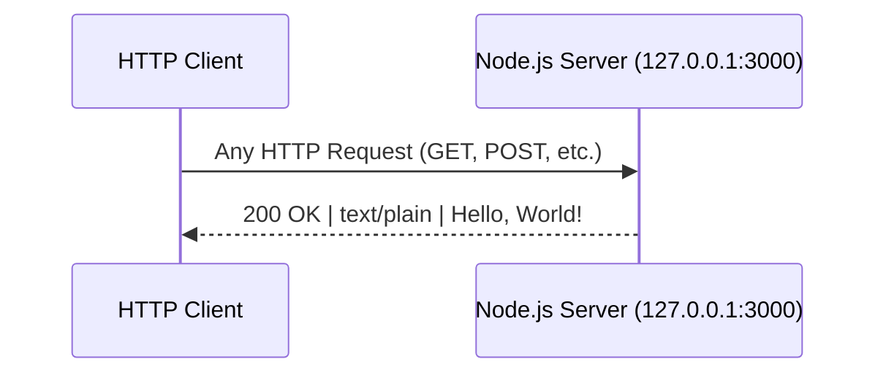
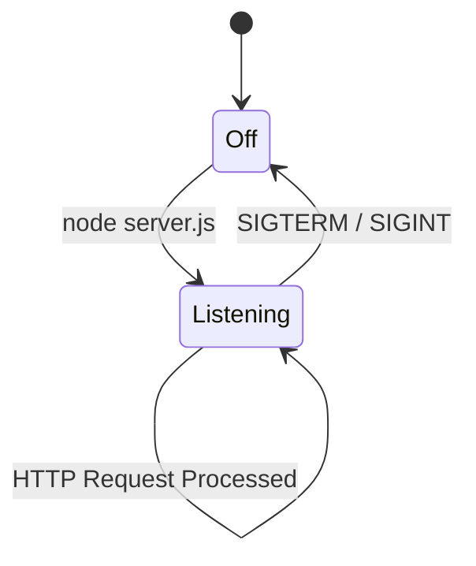

# Technical Specification

# 0. Agent Action Plan

## 0.1 Intent Clarification


### 0.1.1 Core Documentation Objective

Based on the provided requirements, the Blitzy platform understands that the documentation objective is to **transform the currently undocumented `hao-backprop-test` Node.js HTTP server into a well-documented codebase** by adding JSDoc comments to `server.js` functions and creating a comprehensive README file that serves as the single source of truth for setup, API usage, deployment, and code understanding.

**Request Category:** Create new documentation | Update existing documentation

**Documentation Types:**
- **Inline code documentation** (JSDoc comments in `server.js`)
- **Project README** (comprehensive `README.md` replacing the existing 2-line file)
- **API documentation** (HTTP endpoint reference within README)
- **Deployment guide** (within README)
- **Setup instructions** (within README)
- **Code explanations** (inline comments in `server.js`)

**Requirement Breakdown with Enhanced Clarity:**

- **R-DOC-001: JSDoc Comments for `server.js`** — Add structured JSDoc annotations to every documentable element in `server.js`, including the file-level overview (`@fileOverview`), module import, constant declarations (`hostname`, `port`), the `http.createServer()` request handler callback, and the `server.listen()` invocation. Each JSDoc block must include `@description`, `@param` (where applicable), `@type`, `@constant`, and `@returns` tags following standard JSDoc 4.x syntax.

- **R-DOC-002: Comprehensive README** — Replace the existing 2-line `README.md` with a full project README containing:
  - Project title, description, and badges
  - Table of contents
  - Prerequisites and setup instructions
  - API documentation (endpoint, method, response format)
  - Deployment guide (local and basic production considerations)
  - Project structure overview
  - License information

- **R-DOC-003: Inline Code Explanations** — Add clear, concise inline comments (`//` style) throughout `server.js` that explain the purpose and behavior of each code block, targeting developers who are new to Node.js HTTP server patterns.

**Inferred Documentation Needs:**
- Based on code analysis: `server.js` contains zero documentation — no JSDoc, no inline comments, no file header
- Based on structure: The `package.json` declares `"main": "index.js"` but no such file exists; this anomaly should be documented in the README
- Based on user journey: A developer encountering this project needs to understand what it does, how to run it, what the HTTP endpoint returns, and how the code works — all currently absent

### 0.1.2 Special Instructions and Constraints

**Critical Directives:**
- **"Make minimal changes"** — Confine all changes to the defined scope and nowhere else. Maintain all public interfaces, side effects, data flows, and dependencies unless the spec explicitly mandates adjustments. Do not refactor opportunistically. Avoid cascading changes, cross-file edits outside of documentation scope, or global updates. Changes must be minimal, isolated, and fully aligned with the scoped objective.
- Documentation changes are restricted to `server.js` (JSDoc + inline comments) and `README.md` (comprehensive rewrite) only
- No source code logic modifications — only documentation annotations are permitted
- No changes to `server - Copy.js`, Java files, CSV files, or any other repository files

**Style Preferences:**
- JSDoc comments must follow standard JSDoc 4.x tag syntax (`/** ... */`)
- Inline comments use `//` single-line style
- README must use standard Markdown formatting with proper heading hierarchy
- Code examples in README must use fenced code blocks with language identifiers

**Template Requirements:** None specified by the user — the documentation structure will follow established Node.js community conventions.

### 0.1.3 Technical Interpretation

These documentation requirements translate to the following technical documentation strategy:

- To **document server.js functions**, we will **update** `server.js` by adding JSDoc comment blocks (`/** ... */`) above each documentable element (module require, constants, createServer callback, listen invocation) and inline explanatory comments (`//`) throughout the file body. Source: `server.js` (14 lines, zero existing documentation).

- To **create a comprehensive README**, we will **replace** the existing `README.md` (currently 2 lines: `# hao-backprop-test` and `test project for backprop integration. Do not touch!`) with a complete project README containing setup instructions, API documentation, a deployment guide, and a project overview. Source: `README.md`, `package.json`, `server.js`.

- To **provide inline code explanations**, we will **add** descriptive single-line comments within `server.js` that explain each logical section: module loading, configuration constants, server creation, request handling, and server startup. This is part of the `server.js` update, not a separate file.

### 0.1.4 Inferred Documentation Needs

- **Known anomaly documentation:** `package.json` declares `"main": "index.js"` but no `index.js` exists in the repository — the README must note that the actual entry point is `server.js` and document the correct startup command (`node server.js`)
- **Zero-dependency clarity:** The README must explicitly state that no `npm install` step is needed since the project has zero external dependencies (confirmed via `package.json` and `package-lock.json`)
- **Localhost-only binding:** The API documentation must clearly note the server binds to `127.0.0.1` (not `0.0.0.0`), meaning it is not externally accessible by default
- **Error scenario documentation:** The README deployment guide should document common startup errors (`EADDRINUSE` when port 3000 is occupied, `EACCES` for permission issues)
- **License visibility:** `package.json` declares MIT license — this should be reflected in the README


## 0.2 Documentation Discovery and Analysis


### 0.2.1 Existing Documentation Infrastructure Assessment

Repository analysis reveals a **near-zero documentation infrastructure** with a flat, single-directory repository containing 14 files and no documentation tooling whatsoever.

**Search Patterns Employed:**
- Documentation files matching `README*`, `docs/**`, `*.md`, `*.mdx`, `*.rst`, `wiki/**` — Found only `README.md` (2 lines)
- Documentation generator configs (`mkdocs.yml`, `docusaurus.config.js`, `sphinx.conf.py`, `jsdoc.json`, `.jsdoc.conf`) — None found
- Existing API documentation tools (JSDoc, Sphinx, Godoc) — None installed or configured
- Diagram tools (Mermaid, PlantUML) — None configured
- Documentation hosting/deployment setup — None present

**Documentation Infrastructure Summary:**

| Aspect | Status | Detail |
|--------|--------|--------|
| README.md | Exists (minimal) | 2 lines only: project name and "Do not touch!" warning |
| JSDoc comments | Absent | Zero `/** */` blocks in `server.js` |
| Inline code comments | Absent | Zero `//` comments in `server.js` |
| Documentation generator | Not installed | No JSDoc CLI, no MkDocs, no Sphinx |
| Documentation config | Not present | No `jsdoc.json`, `jsdoc.conf`, or equivalent |
| API documentation | Absent | No endpoint documentation of any kind |
| Deployment guide | Absent | No deployment instructions anywhere |
| Setup instructions | Absent | No installation or getting-started guide |
| CONTRIBUTING.md | Absent | No contribution guidelines |
| CHANGELOG.md | Absent | No change history |
| LICENSE file | Absent | License declared in `package.json` (MIT) but no standalone LICENSE file |

### 0.2.2 Repository Code Analysis for Documentation

**Search patterns used to identify code requiring documentation:**

- **Public APIs / Server endpoints:** `server.js` — single HTTP endpoint at `127.0.0.1:3000` responding to all requests with `200 OK` and `Hello, World!\n`
- **Module interfaces:** `server.js` line 1 uses `const http = require('http')` — CommonJS module import of Node.js built-in `http` module
- **Configuration:** Hardcoded constants `hostname = '127.0.0.1'` and `port = 3000` in `server.js` lines 3-4
- **CLI/startup commands:** `node server.js` is the sole operational command; `npm test` is a placeholder that echoes an error

**Key Directories Examined:**
- Root directory (`/`) — all 14 files are at root level with zero subdirectories

**Functional Code Inventory for Documentation:**

| File | Lines | Documentable Elements | Current Documentation |
|------|-------|-----------------------|-----------------------|
| `server.js` | 14 | `require('http')`, `hostname` constant, `port` constant, `http.createServer()` callback, `res.statusCode`, `res.setHeader()`, `res.end()`, `server.listen()` callback | None |
| `package.json` | 11 | Package metadata (name, version, description, main, scripts, author, license) | Self-documenting JSON |
| `README.md` | 2 | Project identifier only | Minimal — name and warning only |

**Related Documentation Found:** None. The repository contains no documentation beyond the 2-line `README.md`.

### 0.2.3 Web Search Research Conducted

- **JSDoc best practices for Node.js CommonJS modules** — Researched standard JSDoc annotation patterns for `require()` imports, constant declarations, callback functions, and server lifecycle methods. Key findings: use `@fileOverview` for file-level docs, `@constant` for module-level constants, `@param` with `{http.IncomingMessage}` and `{http.ServerResponse}` types for request handler callbacks, and `@type` for typed constants.

- **README structure conventions for Node.js projects** — Researched standard sections for minimal Node.js project READMEs. Key sections include: project title/description, table of contents, prerequisites, installation, usage, API reference, deployment, project structure, contributing, and license.

- **JSDoc version and tooling** — Confirmed JSDoc CLI latest version is `4.0.5` (verified via `npm view jsdoc version`). JSDoc comments in source code do not require the JSDoc CLI to be installed — they provide inline documentation and IDE support independently.


## 0.3 Documentation Scope Analysis


### 0.3.1 Code-to-Documentation Mapping

**Module: `server.js` (Primary Documentation Target)**

- **File location:** `server.js` (root)
- **Lines of code:** 14
- **Public APIs / Documentable Elements:**
  - `require('http')` — Module import (line 1)
  - `hostname` constant — Server bind address `'127.0.0.1'` (line 3)
  - `port` constant — Server bind port `3000` (line 4)
  - `http.createServer()` callback — Request handler `(req, res) => { ... }` (lines 6-10)
  - `res.statusCode = 200` — HTTP status setting (line 7)
  - `res.setHeader('Content-Type', 'text/plain')` — Response header (line 8)
  - `res.end('Hello, World!\n')` — Response body (line 9)
  - `server.listen()` callback — Server startup with console log (lines 12-14)
- **Current documentation:** None — zero JSDoc blocks, zero inline comments
- **Documentation needed:** JSDoc annotations for all elements above, plus inline `//` comments explaining each logical section

**Module: `README.md` (Documentation Overhaul Target)**

- **File location:** `README.md` (root)
- **Current content:** 2 lines — `# hao-backprop-test` and `test project for backprop integration. Do not touch!`
- **Documentation needed:** Complete rewrite with setup instructions, API documentation, deployment guide, project structure, and license

**Configuration Options Requiring Documentation:**

| Config Element | Location | Current Doc Status | Documentation Needed |
|----------------|----------|--------------------|----------------------|
| `hostname` (`127.0.0.1`) | `server.js:3` | Undocumented | JSDoc `@constant` + inline explanation of localhost binding |
| `port` (`3000`) | `server.js:4` | Undocumented | JSDoc `@constant` + inline explanation of port selection |
| `name` (`hello_world`) | `package.json:2` | Self-documenting | Reference in README |
| `version` (`1.0.0`) | `package.json:3` | Self-documenting | Reference in README |
| `main` (`index.js`) | `package.json:5` | Incorrect — file doesn't exist | Document anomaly in README |
| `license` (`MIT`) | `package.json:10` | Self-documenting | Add license section to README |

### 0.3.2 Documentation Gap Analysis

Given the requirements and repository analysis, documentation gaps include:

**Undocumented Code Elements (Complete List):**
- `server.js` — 100% undocumented: zero JSDoc, zero inline comments, zero file header
- HTTP endpoint behavior — No description of request/response contract anywhere in repository
- Server lifecycle — No documentation of startup sequence, binding behavior, or shutdown

**Missing User-Facing Documentation:**
- Setup / getting-started instructions — completely absent
- API reference for the HTTP endpoint — completely absent
- Deployment guidance — completely absent
- Troubleshooting / error handling guide — completely absent
- Project structure explanation — completely absent

**Known Anomalies Requiring Documentation:**
- `package.json` declares `"main": "index.js"` but no `index.js` exists — actual entry point is `server.js`
- `server - Copy.js` exists as an exact byte-for-byte duplicate of `server.js` — purpose unclear
- `npm test` script is a non-functional placeholder: `echo "Error: no test specified" && exit 1`

**Coverage Summary:**

| Documentation Area | Current Coverage | Target Coverage |
|--------------------|------------------|-----------------|
| JSDoc annotations in `server.js` | 0% (0/8 elements) | 100% (8/8 elements) |
| Inline code comments in `server.js` | 0% (0 comments) | 100% (all logical sections) |
| README sections | 8% (name only) | 100% (all required sections) |
| API endpoint documentation | 0% | 100% |
| Setup instructions | 0% | 100% |
| Deployment guide | 0% | 100% |


## 0.4 Documentation Implementation Design


### 0.4.1 Documentation Structure Planning

Since this is a minimal, flat repository with no subdirectories, all documentation resides in two root-level files. No separate `docs/` directory is warranted given the project's scope and the "make minimal changes" constraint.

**Target Documentation Structure:**
```
/ (repository root)
├── README.md          (comprehensive project documentation — REWRITE)
└── server.js          (JSDoc comments + inline explanations — UPDATE)
```

**README.md Section Hierarchy:**
```
README.md
├── Project Title & Description
├── Table of Contents
├── Prerequisites
├── Installation & Setup
├── Usage (Running the Server)
├── API Documentation
│   ├── Endpoint Overview
│   ├── Request/Response Details
│   └── Example Usage (curl)
├── Deployment Guide
│   ├── Local Development
│   ├── Production Considerations
│   └── Common Issues & Troubleshooting
├── Project Structure
├── Configuration
├── Known Limitations
└── License
```

**server.js Documentation Structure:**
```
server.js
├── @fileOverview (file-level JSDoc block)
├── @module declaration
├── require('http') — inline comment
├── hostname @constant — JSDoc + inline comment
├── port @constant — JSDoc + inline comment
├── createServer callback — JSDoc with @param/@returns
│   ├── res.statusCode — inline comment
│   ├── res.setHeader — inline comment
│   └── res.end — inline comment
└── server.listen — JSDoc with @param + inline comment
```

### 0.4.2 Content Generation Strategy

**Information Extraction Approach:**

- Extract server configuration details from `server.js` lines 1-4 (hostname, port, http module)
- Extract request handler behavior from `server.js` lines 6-10 (status code, content type, response body)
- Extract startup behavior from `server.js` lines 12-14 (listen callback with console.log)
- Extract package metadata from `package.json` (name, version, description, author, license)
- Generate API documentation from the HTTP endpoint behavior observed in `server.js`
- Document known anomaly: `package.json` `"main": "index.js"` mismatch from `package.json` line 5

**Documentation Standards:**

- **JSDoc format:** Standard `/** ... */` blocks with `@fileOverview`, `@module`, `@constant`, `@type`, `@param`, `@description`, and `@returns` tags
- **Inline comments:** Single-line `//` style, placed above the code they describe
- **Markdown formatting:** Proper heading hierarchy (`#` through `####`), fenced code blocks with language identifiers (` ```bash `, ` ```javascript `), tables for structured data
- **Source citations:** References to specific file paths and line numbers (e.g., `Source: server.js:6-10`)
- **Consistent terminology:** "server" (not "app"), "request handler" (not "route handler"), "response" (not "reply")

### 0.4.3 Diagram and Visual Strategy

**Mermaid Diagrams for README.md:**

- **Server Request Flow Diagram** — A sequence diagram showing the HTTP request/response cycle from client to server and back, illustrating the static nature of the response. This diagram will be embedded directly in the API Documentation section of the README.



- **Server Lifecycle Diagram** — A simple state diagram showing Off → Initializing → Listening states, embedded in the Deployment Guide section of the README.



No screenshots or images are required — the project has no UI. All visual documentation is handled through Mermaid diagrams embedded in Markdown.


## 0.5 Documentation File Transformation Mapping


### 0.5.1 File-by-File Documentation Plan

The following table maps every documentation file to be created, updated, or referenced as part of this documentation exercise. The target documentation file is listed first.

| Target Documentation File | Transformation | Source Code/Docs | Content/Changes |
|---------------------------|----------------|------------------|-----------------|
| `README.md` | UPDATE | `README.md`, `package.json`, `server.js` | Complete rewrite: replace 2-line file with comprehensive README containing project overview, table of contents, prerequisites, installation/setup instructions, usage guide, API documentation with endpoint details and curl examples, deployment guide with local and production considerations plus troubleshooting, project structure overview, configuration reference, known limitations, and MIT license section |
| `server.js` | UPDATE | `server.js` | Add JSDoc comment blocks (`/** ... */`) for file-level overview (`@fileOverview`, `@module`), `hostname` constant (`@constant`, `@type`), `port` constant (`@constant`, `@type`), `http.createServer()` request handler callback (`@param {http.IncomingMessage}`, `@param {http.ServerResponse}`), and `server.listen()` startup. Add inline `//` comments explaining each logical section: module import, configuration constants, server creation, request handling (status code, header, body), and startup with console output |

**Documentation Source Files (REFERENCE mode):**

| Source File | Transformation | Purpose |
|-------------|----------------|---------|
| `package.json` | REFERENCE | Extract project metadata: name (`hello_world`), version (`1.0.0`), description (`Hello world in Node.js`), author (`hxu`), license (`MIT`), main entry point anomaly (`index.js` declared but absent) |
| `package-lock.json` | REFERENCE | Confirm zero external dependencies (lockfileVersion 3, empty packages set) |
| `server - Copy.js` | REFERENCE | Confirm it is a byte-identical duplicate of `server.js` for project structure documentation |

### 0.5.2 File Update Details — `server.js`

```
File: server.js
Type: Inline Code Documentation (JSDoc + Comments)
Source: server.js (14 lines, zero existing documentation)
Changes:
    - Add @fileOverview JSDoc block at top of file describing the server's purpose
    - Add @module tag declaring CommonJS module identity
    - Add @constant JSDoc for hostname ('127.0.0.1') with @type {string}
    - Add @constant JSDoc for port (3000) with @type {number}
    - Add JSDoc for createServer callback with @param {http.IncomingMessage} req, @param {http.ServerResponse} res
    - Add inline // comments explaining: require import, constant purpose, response status, header setting, body output, listen behavior
    - Add JSDoc for server.listen callback explaining startup logging
Diagrams: None (inline documentation only)
Key Citations: server.js:1-14
```

### 0.5.3 File Update Details — `README.md`

```
File: README.md
Type: Project Documentation (comprehensive rewrite)
Source: README.md (2 lines), package.json (metadata), server.js (behavior)
Sections:
    - Project Title and Description (from package.json: "Hello world in Node.js")
    - Table of Contents (auto-linked section references)
    - Prerequisites (Node.js runtime requirement)
    - Installation and Setup (clone + node server.js, note: no npm install needed)
    - Usage / Running the Server (node server.js, expected console output)
    - API Documentation:
        - Endpoint: http://127.0.0.1:3000
        - Method: Any (GET, POST, PUT, DELETE, etc.)
        - Response: 200 OK, Content-Type: text/plain, Body: "Hello, World!\n"
        - Example curl command and expected output
    - Deployment Guide:
        - Local development (direct node execution)
        - Production considerations (process managers, port configuration)
        - Common issues (EADDRINUSE, EACCES)
    - Project Structure (table of all 14 files with descriptions)
    - Configuration (hostname and port constants in server.js)
    - Known Limitations (localhost-only, no routing, no middleware, main/index.js mismatch)
    - License (MIT, as declared in package.json)
Diagrams:
    - Mermaid sequence diagram: HTTP request/response flow
    - Mermaid state diagram: Server lifecycle (Off → Listening → Off)
Key Citations: package.json, server.js, package-lock.json
```

### 0.5.4 Documentation Configuration Updates

No documentation configuration files need to be created or updated. The project has no documentation generator (`mkdocs.yml`, `docusaurus.config.js`, `.readthedocs.yml`, `jsdoc.json`, etc.) and none are required for the scope of this task. JSDoc comments serve as inline documentation without requiring a build step, and the README is a standalone Markdown file.

### 0.5.5 Cross-Documentation Dependencies

- **server.js JSDoc ↔ README API section:** The README's API Documentation section must accurately reflect the endpoint behavior documented in `server.js` JSDoc comments (status code 200, Content-Type text/plain, body "Hello, World!\n")
- **package.json ↔ README metadata:** The README's project description, version, author, and license sections must match the values in `package.json`
- **server.js constants ↔ README Configuration section:** The hostname (`127.0.0.1`) and port (`3000`) documented in `server.js` JSDoc `@constant` tags must be consistent with the README's Configuration and API Documentation sections
- **Navigation:** The README's table of contents must link to all sections within the same document
- **No cross-file import dependencies:** `server.js` documentation is self-contained; `README.md` documentation is self-contained; they reference the same behavioral facts but do not include/import each other


## 0.6 Dependency Inventory


### 0.6.1 Documentation Dependencies

The project has **zero external npm dependencies** as confirmed by both `package.json` (no `dependencies` or `devDependencies` fields) and `package-lock.json` (lockfileVersion 3 with an empty packages set beyond the root entry). The documentation task itself does not require installing any additional tooling, since JSDoc comments are written directly in source code and the README is a standalone Markdown file.

**Runtime Dependencies Required for Documented Behavior:**

| Registry | Package Name | Version | Purpose |
|----------|--------------|---------|---------|
| Built-in | `http` (Node.js) | Bundled with Node.js | Core HTTP server module — the sole import in `server.js` line 1 |

**Documentation Tooling (Optional — NOT required for this task):**

| Registry | Package Name | Version | Purpose |
|----------|--------------|---------|---------|
| npm | `jsdoc` | 4.0.5 | JSDoc CLI for generating HTML documentation from JSDoc comments (not required — comments provide inline docs without build step) |

**Rationale for Zero Additional Dependencies:**
- JSDoc annotations are standard JavaScript comments (`/** ... */`) that work natively in all JavaScript editors and IDEs without any tooling
- The README is a standard Markdown file rendered by GitHub, GitLab, and all major code hosting platforms
- Mermaid diagrams in the README are rendered natively by GitHub's Markdown parser
- The "make minimal changes" rule prohibits adding new dependencies to `package.json`

### 0.6.2 Documentation Reference Updates

No documentation link updates are required. The existing `README.md` contains zero internal or external links. The new README will establish all links from scratch as part of the table of contents (internal anchor links) and will not reference any external documentation URLs beyond standard Node.js documentation.

**Link Patterns in New README:**

| Link Type | Pattern | Target |
|-----------|---------|--------|
| Table of contents anchors | `[Section Name](#section-name)` | Internal sections within `README.md` |
| Node.js documentation | `https://nodejs.org/` | External reference for prerequisites |
| Node.js HTTP module docs | `https://nodejs.org/api/http.html` | External reference for API context |


## 0.7 Coverage and Quality Targets


### 0.7.1 Documentation Coverage Metrics

**Current Coverage Analysis:**

| Documentation Area | Documented | Total | Coverage |
|--------------------|-----------|-------|----------|
| Public APIs (HTTP endpoints) | 0 | 1 | 0% |
| JSDoc annotations in `server.js` | 0 | 8 elements | 0% |
| Inline code comments in `server.js` | 0 | 6 logical sections | 0% |
| README sections (setup, API, deploy, etc.) | 0 | 11 target sections | 0% |
| Configuration options documented | 0 | 2 (hostname, port) | 0% |

**Target Coverage After Implementation:**

| Documentation Area | Target | Coverage |
|--------------------|--------|----------|
| Public APIs (HTTP endpoints) | 1/1 | 100% |
| JSDoc annotations in `server.js` | 8/8 elements | 100% |
| Inline code comments in `server.js` | 6/6 logical sections | 100% |
| README sections | 11/11 target sections | 100% |
| Configuration options documented | 2/2 | 100% |

**Coverage Gaps to Address:**
- `server.js`: Currently 0% documented → target 100% with JSDoc blocks on all 8 documentable elements and inline comments on all 6 logical sections
- `README.md`: Currently ~8% (title only) → target 100% with all 11 sections populated

### 0.7.2 Documentation Quality Criteria

**Completeness Requirements:**
- Every documentable element in `server.js` must have a JSDoc block with appropriate tags (`@description`, `@param`, `@type`, `@constant`, `@returns` as applicable)
- Every logical code section in `server.js` must have at least one inline `//` comment explaining its purpose
- The README must include working `curl` examples with expected output
- The README API section must document the exact HTTP status code, content type, and response body
- The README deployment guide must cover at least three common error scenarios

**Accuracy Validation:**
- All JSDoc `@param` types must match the actual Node.js types (`http.IncomingMessage`, `http.ServerResponse`)
- All code examples in the README must be verifiable by running `node server.js` and executing the documented `curl` command
- The hostname (`127.0.0.1`) and port (`3000`) in documentation must match the hardcoded values in `server.js` lines 3-4
- Package metadata in README (name, version, license) must match `package.json` exactly

**Clarity Standards:**
- JSDoc descriptions must be concise (one sentence per description where possible)
- Inline comments must explain "why" and "what", not merely restate the code
- README sections must follow progressive disclosure: overview → setup → usage → API → advanced (deployment)
- Consistent terminology: "server" (not "app" or "application"), "request handler" (not "route handler"), "response body" (not "payload")

**Maintainability:**
- JSDoc tags must reference source file locations for traceability
- README must cite `server.js` and `package.json` as authoritative sources
- No auto-generated content that would become stale without a build step

### 0.7.3 Example and Diagram Requirements

- **Minimum examples per API endpoint:** 1 (curl command with full request and expected response)
- **Diagram types required:**
  - 1 × Mermaid sequence diagram (HTTP request/response flow) in README
  - 1 × Mermaid state diagram (server lifecycle) in README
- **Code example verification:** All examples can be tested by running `node server.js` and executing `curl http://127.0.0.1:3000/`
- **Visual content freshness:** Diagrams are Mermaid-based and generated at render time — no static images to become stale


## 0.8 Scope Boundaries


### 0.8.1 Exhaustively In Scope

**Documentation File Updates:**
- `server.js` — Add JSDoc comment blocks and inline `//` explanatory comments (documentation-only changes; no logic modifications)
- `README.md` — Complete rewrite with comprehensive project documentation

**Documentation Content to Produce:**
- JSDoc `@fileOverview` block for `server.js`
- JSDoc `@module` declaration for `server.js`
- JSDoc `@constant` annotations for `hostname` and `port` variables
- JSDoc `@param` and callback documentation for `http.createServer()` request handler
- JSDoc documentation for `server.listen()` invocation and its callback
- Inline `//` comments for all logical sections in `server.js`
- README project title, description, and badge section
- README table of contents with anchor links
- README prerequisites section (Node.js runtime)
- README installation and setup instructions
- README usage / running the server section
- README API documentation section (endpoint, methods, response format, curl examples)
- README deployment guide (local development, production considerations, troubleshooting)
- README project structure overview (all 14 repository files)
- README configuration reference (hostname, port constants)
- README known limitations section
- README license section (MIT)
- Mermaid sequence diagram (request/response flow) embedded in README
- Mermaid state diagram (server lifecycle) embedded in README

**Source Files Referenced (read-only, for information extraction):**
- `package.json` — metadata extraction (name, version, author, license, scripts)
- `package-lock.json` — dependency verification (zero external deps confirmed)
- `server - Copy.js` — duplicate confirmation for project structure documentation

### 0.8.2 Explicitly Out of Scope

- **Source code logic modifications** — No changes to the functional behavior of `server.js` (the `http.createServer()` callback, hostname/port constants, and `server.listen()` invocation remain untouched)
- **`server - Copy.js` modifications** — No documentation changes to the duplicate file; only `server.js` is in scope per the user's requirement ("Add JSDoc comments to server.js functions")
- **Java file modifications** — `LoginTest.java` and `LoginTest - Copy.java` are out of scope
- **CSV file modifications** — `industry.csv` and `industry - Copy.csv` are out of scope
- **Empty placeholder file modifications** — `.blitzyignore.txt`, `test.blitzyignore.txt`, `test1.blitzyignore.txt`, `test.py.txt`, `test.py - Copy.txt` are out of scope
- **`package.json` modifications** — No changes to package metadata, scripts, or dependency declarations
- **`package-lock.json` modifications** — No changes to the lockfile
- **New file creation** — No new files will be created (no `CONTRIBUTING.md`, `CHANGELOG.md`, `LICENSE`, `docs/` directory, or `jsdoc.json`); the "make minimal changes" rule restricts scope to existing files only
- **Documentation generator installation** — No `jsdoc` CLI, `mkdocs`, or other documentation build tools will be added to `package.json` devDependencies
- **Test file modifications** — No changes to test configuration or scripts
- **Feature additions or code refactoring** — Strictly prohibited by the "make minimal changes" rule
- **Deployment configuration changes** — No Dockerfile, CI/CD configs, or process manager configs
- **Any content not explicitly specified** — The user requested JSDoc for `server.js`, a comprehensive README, and inline code explanations; nothing beyond these three deliverables


## 0.9 Rules for Documentation


### 0.9.1 User-Specified Rules

The following rules are explicitly provided by the user and must be strictly observed:

- **"Make minimal changes"** — Confine all changes to the defined scope and nowhere else. Maintain all public interfaces, side effects, data flows, and dependencies unless the spec explicitly mandates adjustments. Do not refactor opportunistically. Avoid cascading changes, cross-file edits, or global updates. Changes must be minimal, isolated, and fully aligned with the scoped objective.

### 0.9.2 Derived Documentation Rules

Based on the user's requirements and the "make minimal changes" directive, the following documentation-specific rules apply:

- **Modify only `server.js` and `README.md`** — No other files may be created, modified, or deleted
- **Documentation-only changes to `server.js`** — Only JSDoc comments (`/** ... */`) and inline comments (`//`) may be added; no functional code may be altered, reordered, or reformatted
- **Preserve existing code formatting** — The original indentation, spacing, and line structure of `server.js` must remain intact; documentation is additive only
- **No new dependencies** — Do not add any packages to `package.json` (neither `dependencies` nor `devDependencies`)
- **No new files** — Do not create `CONTRIBUTING.md`, `CHANGELOG.md`, `LICENSE`, `jsdoc.json`, or any `docs/` directory
- **Consistent JSDoc syntax** — Use standard JSDoc 4.x tag format with `@fileOverview`, `@module`, `@constant`, `@type`, `@param`, `@description`, and `@returns`
- **Inline comments explain intent** — Comments must explain "why" or "what" a section does, not merely restate the code in English
- **README must be self-contained** — All information needed to understand, set up, run, and deploy the server must be present within `README.md` without requiring readers to inspect source code
- **Accuracy over completeness** — If documentation cannot be 100% verified against the source code, omit the claim rather than speculate
- **Cite source locations** — JSDoc blocks and README sections should reference specific files and line numbers where the documented behavior is defined


## 0.10 References


### 0.10.1 Repository Files Searched and Analyzed

The following files and folders were retrieved and analyzed during the preparation of this Agent Action Plan:

| File Path | Purpose of Analysis | Key Findings |
|-----------|---------------------|--------------|
| `server.js` | Primary documentation target — read in full (lines 1-14) | 14-line CommonJS HTTP server using built-in `http` module; binds to `127.0.0.1:3000`; responds to all requests with `200 OK`, `text/plain`, `Hello, World!\n`; zero JSDoc, zero inline comments |
| `server - Copy.js` | Duplicate verification — read in full (lines 1-14) | Byte-identical duplicate of `server.js`; out of scope for documentation changes |
| `package.json` | Metadata extraction — read in full (lines 1-11) | Package name: `hello_world`, version: `1.0.0`, description: `Hello world in Node.js`, author: `hxu`, license: `MIT`, main: `index.js` (mismatch — file does not exist), zero dependencies |
| `package-lock.json` | Dependency confirmation — read in full (lines 1-13) | lockfileVersion 3, zero external packages beyond root entry |
| `README.md` | Current documentation baseline — read in full (lines 1-2) | Contains only: `# hao-backprop-test` and `test project for backprop integration. Do not touch!` |
| `.blitzyignore.txt` | Ignore pattern check | Empty file (zero bytes) — no ignore patterns defined |
| `test.blitzyignore.txt` | Ignore pattern check | Empty file (zero bytes) — no ignore patterns defined |
| `test1.blitzyignore.txt` | Ignore pattern check | Empty file (zero bytes) — no ignore patterns defined |
| Root folder (`/`) | Repository structure analysis via `get_source_folder_contents` | 14 files in flat structure, zero subdirectories; mixed file types: JS, Java, CSV, JSON, MD, TXT |

### 0.10.2 Technical Specification Sections Referenced

| Section | Purpose |
|---------|---------|
| 1.1 Executive Summary | Project context: test fixture for Backprop integration, stakeholder identification |
| 1.2 System Overview | System components: 14-file inventory, HTTP server capability, Blitzy ecosystem integration |
| 1.3 Scope | In-scope/out-of-scope boundaries, known anomalies (`main: index.js` mismatch), operational workflow |
| 2.1 Feature Catalog | Feature inventory: F-001 (HTTP Server), F-002 (Test Fixture), F-003 (File Diversity) |
| 3.1 Programming Languages | JavaScript/Node.js as sole functional language, CommonJS module system, version compatibility |
| 5.2 Component Details | HTTP server component architecture, request handler behavior, sequence diagrams |
| 6.1 Core Services Architecture | Non-applicability of services architecture, architectural decision records |

### 0.10.3 External Research Conducted

| Research Topic | Source | Key Insight |
|----------------|--------|-------------|
| JSDoc best practices for Node.js | jsdoc.app (official docs) | Use `@fileOverview` for file headers, `@module` for CommonJS modules, `@constant` for constants, `@param` with Node.js types for callbacks |
| JSDoc integration in Node.js | w3tutorials.net, HackerOne/PullRequest blog | JSDoc comments work without CLI installation; use `@type`, `@param`, `@returns` tags; be descriptive but concise |
| JSDoc style guide patterns | GitHub (shri/JSDoc-Style-Guide) | Use `@fileOverview` at file top, `@namespace` and `@memberOf` for organization, vertical alignment of tags |
| JavaScript commenting best practices | daily.dev | Explain "why" over "how" in comments; use JSDoc for function-level docs, `//` for implementation notes |
| Node.js README conventions | Community templates and best practices | Standard sections: prerequisites, installation, usage, API reference, deployment, project structure, license |
| JSDoc CLI version | npm registry (`npm view jsdoc version`) | Latest stable: `4.0.5` (not required for this task — comments are inline) |

### 0.10.4 Attachments and External Resources

No attachments were provided by the user for this project. No Figma screens, design mockups, or external URLs were referenced in the user's requirements.

### 0.10.5 Environment Details

| Attribute | Value |
|-----------|-------|
| Node.js version (installed) | v20.20.1 |
| npm version (installed) | 11.1.0 |
| Package lockfile version | 3 |
| External dependencies | Zero |
| Environment variables provided | None |
| Secrets provided | None |
| User setup instructions | None provided |


